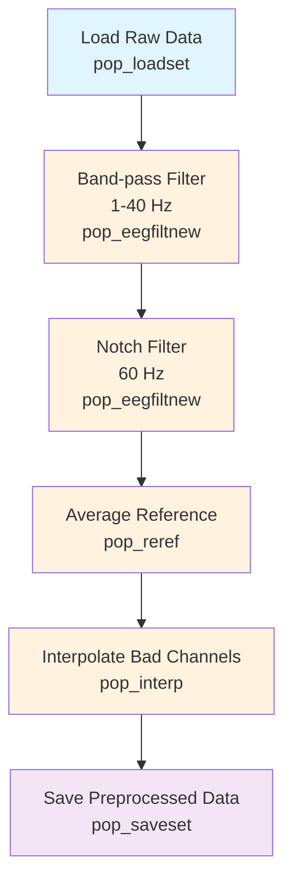

# Example: Basic EEG Preprocessing Pipeline (EEGLAB)

This page explains the [`basic_preprocessing_pipeline_eeglab.signalJourney.json`](https://github.com/neuromechanist/signalJourney/blob/main/schema/examples/basic_preprocessing_pipeline_eeglab.signalJourney.json) example file, which documents a standard EEG preprocessing workflow using EEGLAB.

## Pipeline Overview

The EEGLAB basic preprocessing pipeline demonstrates fundamental EEG preprocessing steps using EEGLAB functions:

- **Load raw data** from EEGLAB .set format
- **Apply band-pass filtering** (1-40 Hz) using `pop_eegfiltnew`
- **Apply notch filtering** (60 Hz) using `pop_eegfiltnew`
- **Set average reference** using `pop_reref`
- **Interpolate bad channels** using `pop_interp`

## Pipeline Flowchart



## Key EEGLAB Features Demonstrated

### EEGLAB Function Calls
- **`pop_loadset`**: Load EEGLAB dataset files (.set/.fdt)
- **`pop_eegfiltnew`**: Modern FIR filtering with linear phase
- **`pop_reref`**: Re-referencing to average or specific channels
- **`pop_interp`**: Spherical spline interpolation for bad channels
- **`pop_saveset`**: Save processed datasets

### EEGLAB-Specific Parameters
- **Filter specifications**: Uses EEGLAB's default FIR filter parameters
- **Channel selection**: EEGLAB channel indexing and selection
- **Dataset structure**: EEGLAB EEG structure format preservation

## Example JSON Structure

The signalJourney file documents each processing step with:

```json
{
  "stepId": "2",
  "name": "Band-pass Filter",
  "description": "Apply band-pass filter (1-40 Hz) to remove low-frequency drift and high-frequency noise.",
  "software": {
    "name": "EEGLAB",
    "version": "2023.1",
    "functionCall": "pop_eegfiltnew(EEG, 'locutoff', 1, 'hicutoff', 40)"
  },
  "parameters": {
    "locutoff": 1.0,
    "hicutoff": 40.0,
    "filterOrder": "auto",
    "revfilt": 0
  }
}
```

### Quality Control Integration
Each step includes quality metrics specific to EEGLAB processing:
- Channel counts and indices
- Filter specifications and verification
- Reference channel information
- Interpolation success metrics

## EEGLAB vs MNE-Python Comparison

| Aspect | EEGLAB Version | MNE-Python Version |
|--------|----------------|-------------------|
| **Data Format** | .set/.fdt files | .fif files |
| **Filtering** | `pop_eegfiltnew` | `filter`, `notch_filter` |
| **Referencing** | `pop_reref` | `set_eeg_reference` |
| **Interpolation** | `pop_interp` | `interpolate_bads` |
| **Function Style** | Pop-up GUI functions | Object methods |

## Usage Notes

This example demonstrates:
- **EEGLAB workflow patterns** with pop_ functions
- **Parameter documentation** for reproducible processing
- **File format handling** for EEGLAB datasets
- **Quality metrics** relevant to EEGLAB processing

The pipeline is designed to be representative of standard EEGLAB preprocessing workflows while maintaining full parameter transparency for reproducibility. 