# Example: Basic EEG Preprocessing Pipeline (EEGLAB)

This page explains the [`basic_preprocessing_pipeline_eeglab.signalJourney.json`](https://github.com/neuromechanist/signalJourney/blob/main/schema/examples/basic_preprocessing_pipeline_eeglab.signalJourney.json) example file, which documents a standard EEG preprocessing workflow using EEGLAB.

## Pipeline Overview

The EEGLAB basic preprocessing pipeline demonstrates fundamental EEG preprocessing steps using EEGLAB functions:

- **Load raw data** from EEGLAB .set format
- **Apply high-pass filtering** (1 Hz) using `pop_eegfiltnew`
- **Apply low-pass filtering** (40 Hz) using `pop_eegfiltnew`
- **Apply notch filtering** (60 Hz) using `pop_eegfiltnew`
- **Set average reference** using `pop_reref`
- **Interpolate bad channels** using `pop_interp`

## Pipeline Flowchart

```mermaid
flowchart TD
    A[Load Raw Data<br/>pop_loadset] --> B[High-pass Filter<br/>pop_eegfiltnew<br/>1 Hz]
    B --> C[Low-pass Filter<br/>pop_eegfiltnew<br/>40 Hz]
    C --> D[Notch Filter<br/>pop_eegfiltnew<br/>58-62 Hz]
    D --> E[Average Reference<br/>pop_reref]
    E --> F[Interpolate Bad Channels<br/>pop_interp]
    
    %% Input from sourcedata
    G["📁 sub-01_task-rest_raw.set<br/>Raw EEGLAB dataset"] --> A
    
    %% Intermediate in-memory objects
    A --> A1["📊 EEG Structure<br/>Loaded dataset"]
    B --> B1["📊 EEG Structure<br/>High-pass filtered"]
    C --> C1["📊 EEG Structure<br/>Band-pass filtered"]
    D --> D1["📊 EEG Structure<br/>Notch filtered"]
    E --> E1["📊 EEG Structure<br/>Average referenced"]
    
    %% Final output
    F --> H["💾 sub-01_task-rest_desc-preproc_eeg.set<br/>Preprocessed dataset"]
    
    %% Quality metrics
    E --> Q1["📈 Reference type: average<br/>Channels: 62"]
    F --> Q2["📈 Interpolated: [53, 21]<br/>Method: spherical"]

    %% Styling
    classDef processStep fill:#e1f5fe,stroke:#01579b,stroke-width:2px
    classDef inputFile fill:#fff3e0,stroke:#e65100,stroke-width:2px
    classDef outputFile fill:#e8f5e8,stroke:#1b5e20,stroke-width:2px
    classDef inlineData fill:#f3e5f5,stroke:#4a148c,stroke-width:1px
    classDef qualityMetric fill:#f9f9f9,stroke:#666,stroke-width:1px

    class A,B,C,D,E,F processStep
    class G inputFile
    class H outputFile
    class A1,B1,C1,D1,E1 inlineData
    class Q1,Q2 qualityMetric
```



## Key EEGLAB Features Demonstrated

### EEGLAB Function Calls
- **`pop_loadset`**: Load EEGLAB dataset files (.set/.fdt)
- **`pop_eegfiltnew`**: Modern FIR filtering with linear phase
- **`pop_reref`**: Re-referencing to average or specific channels
- **`pop_interp`**: Spherical spline interpolation for bad channels
- **`pop_saveset`**: Save processed datasets

### EEGLAB-Specific Parameters
- **Filter specifications**: Uses EEGLAB's default FIR filter parameters
- **Channel selection**: EEGLAB channel indexing and selection
- **Dataset structure**: EEGLAB EEG structure format preservation

## Example JSON Structure

The signalJourney file documents each processing step with:

```json
{
  "stepId": "2",
  "name": "Apply High-pass Filter",
  "description": "Apply a FIR high-pass filter at 1 Hz.",
  "software": {
    "name": "EEGLAB",
    "version": "2023.1",
    "functionCall": "pop_eegfiltnew(EEG, 'locutoff', 1, 'plotfreqz', 0)"
  },
  "parameters": {
    "locutoff": 1.0,
    "hicutoff": null,
    "filtorder": [],
    "revfilt": 0,
    "usefft": 1,
    "plotfreqz": 0
  }
}
```

### Quality Control Integration
Each step includes quality metrics specific to EEGLAB processing:
- Channel counts and indices
- Filter specifications and verification
- Reference channel information
- Interpolation success metrics

## EEGLAB vs MNE-Python Comparison

| Aspect | EEGLAB Version | MNE-Python Version |
|--------|----------------|-------------------|
| **Data Format** | .set/.fdt files | .fif files |
| **Filtering** | `pop_eegfiltnew` | `filter`, `notch_filter` |
| **Referencing** | `pop_reref` | `set_eeg_reference` |
| **Interpolation** | `pop_interp` | `interpolate_bads` |
| **Function Style** | Pop-up GUI functions | Object methods |
| **Filter Design** | Separate high/low pass | Combined band-pass |

## EEGLAB-Specific Workflow

### Step-by-Step Filtering Approach
Unlike MNE-Python's combined band-pass filter, EEGLAB demonstrates:
1. **Separate high-pass filtering** for drift removal
2. **Separate low-pass filtering** for noise reduction  
3. **Independent notch filtering** for line noise

### EEG Structure Preservation
EEGLAB maintains the EEG structure throughout processing:
- **Channel information** preserved across all steps
- **Event markers** maintained during filtering
- **Dataset history** automatically tracked

## Usage Notes

This example demonstrates:
- **EEGLAB workflow patterns** with pop_ functions
- **Parameter documentation** for reproducible processing
- **File format handling** for EEGLAB datasets
- **Quality metrics** relevant to EEGLAB processing
- **Sequential filtering approach** common in EEGLAB pipelines

The pipeline is designed to be representative of standard EEGLAB preprocessing workflows while maintaining full parameter transparency for reproducibility. 