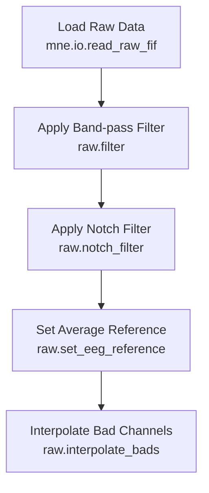

# Example: Basic EEG Preprocessing Pipeline (MNE-Python)

This page explains the [`basic_preprocessing_pipeline_mne.signalJourney.json`](https://github.com/neuromechanist/signalJourney/blob/main/schema/examples/basic_preprocessing_pipeline_mne.signalJourney.json) example file, which documents a standard EEG preprocessing workflow using MNE-Python.

## Pipeline Overview

The MNE-Python basic preprocessing pipeline demonstrates fundamental EEG preprocessing steps using MNE-Python functions:

- **Load raw data** from FIF format
- **Apply band-pass filtering** (1-40 Hz) using `raw.filter`
- **Apply notch filtering** (60 Hz) using `raw.notch_filter`
- **Set average reference** using `raw.set_eeg_reference`
- **Interpolate bad channels** using `raw.interpolate_bads`

## Pipeline Flowchart



## JSON Example

See the full JSON file: [`basic_preprocessing_pipeline_mne.signalJourney.json`](https://github.com/neuromechanist/signalJourney/blob/main/schema/examples/basic_preprocessing_pipeline_mne.signalJourney.json)

## Key signalJourney Structure

### 1. Pipeline Metadata

```json
{
  "sj_version": "0.1.0",
  "schema_version": "0.1.0",
  "description": "Example signalJourney file for a basic EEG preprocessing pipeline.",
  "pipelineInfo": {
    "name": "Basic EEG Preprocessing",
    "description": "Standard preprocessing steps including filtering, referencing, and bad channel interpolation using MNE-Python.",
    "pipelineType": "preprocessing",
    "version": "1.0.0",
    "executionDate": "2024-05-02T10:00:00Z"
  }
}
```

The metadata section defines:
- **signalJourney version compatibility** (`sj_version`, `schema_version`)
- **Pipeline identification** (name, type, version)
- **Execution context** (date, description)

### 2. Processing Steps Structure

Each step follows this pattern:

```json
{
  "stepId": "1",
  "name": "Load Raw Data",
  "description": "Load raw FIF data file.",
  "software": {
    "name": "MNE-Python",
    "version": "1.6.1",
    "functionCall": "mne.io.read_raw_fif('sub-01_task-rest_raw.fif', preload=True)"
  },
  "parameters": {
    "filename": "sub-01_task-rest_raw.fif",
    "preload": true
  },
  "inputSources": [...],
  "outputTargets": [...]
}
```

Key elements:
- **Step identification** (`stepId`, `name`, `description`)
- **Software documentation** (exact function calls, versions)
- **Parameter tracking** (all settings used)
- **Input/output specification** (data flow)

### 3. Input Sources

Input sources can be:

**File input** (Step 1):
```json
"inputSources": [
  {
    "sourceType": "file",
    "location": "../sourcedata/sub-01/eeg/sub-01_task-rest_raw.fif",
    "entityLabels": {
      "sub": "01",
      "task": "rest"
    }
  }
]
```

**Previous step output** (Steps 2-5):
```json
"inputSources": [
  {
    "sourceType": "previousStepOutput",
    "stepId": "1",
    "outputId": "Loaded raw data object." 
  }
]
```

### 4. Output Targets

**In-memory objects** (intermediate results):
```json
"outputTargets": [
  {
    "targetType": "in-memory",
    "format": "mne.io.Raw",
    "description": "Band-pass filtered data."
  }
]
```

**Saved files** (final results):
```json
"outputTargets": [
  {
    "targetType": "file",
    "location": "./derivatives/signaljourney/sub-01/eeg/sub-01_task-rest_desc-preproc_eeg.fif",
    "format": "FIF",
    "description": "Preprocessed EEG data file."
  }
]
```

### 5. Quality Metrics

Steps can include quality metrics for validation:

```json
"qualityMetrics": {
  "channelsInterpolated": ["EEG 053", "EEG 021"],
  "numChannelsInterpolated": 2
}
```

### 6. Dependencies

Steps can depend on previous steps:

```json
"dependsOn": ["1", "2", "3"]
```

This ensures proper execution order and data flow.

## Summary Metrics

The pipeline concludes with overall metrics:

```json
"summaryMetrics": {
  "finalSamplingRateHz": 1000,
  "totalChannels": 64,
  "numBadChannelsDetected": 2
}
```

This basic preprocessing example demonstrates:
- **Linear pipeline structure** (each step feeds into the next)
- **File input/output** (loading and saving data)
- **Parameter documentation** (all settings preserved)
- **Quality tracking** (interpolated channels recorded)
- **BIDS compatibility** (entity labels, standardized naming)

This foundation can be extended with more complex processing steps, parallel branches, or integration with other pipelines.
