# Example: Basic EEG Preprocessing Pipeline (MNE-Python)

This page explains the [`basic_preprocessing_pipeline_mne.signalJourney.json`](https://github.com/neuromechanist/signalJourney/blob/main/schema/examples/basic_preprocessing_pipeline_mne.signalJourney.json) example file, which documents a standard EEG preprocessing workflow using MNE-Python.

## Pipeline Overview

The MNE-Python basic preprocessing pipeline demonstrates fundamental EEG preprocessing steps using MNE-Python functions:

- **Load raw data** from FIF format
- **Apply band-pass filtering** (1-40 Hz) using `raw.filter`
- **Apply notch filtering** (60 Hz) using `raw.notch_filter`
- **Set average reference** using `raw.set_eeg_reference`
- **Interpolate bad channels** using `raw.interpolate_bads`

## Pipeline Flowchart

```mermaid
flowchart TD
    A[Load Raw Data<br/>mne.io.read_raw_fif] --> B[Apply Band-pass Filter<br/>raw.filter<br/>1-40 Hz]
    B --> C[Apply Notch Filter<br/>raw.notch_filter<br/>60 Hz]
    C --> D[Set Average Reference<br/>raw.set_eeg_reference]
    D --> E[Interpolate Bad Channels<br/>raw.interpolate_bads]
    
    %% Input from sourcedata
    F["📁 sub-01_task-rest_raw.fif<br/>Raw EEG data"] --> A
    
    %% Intermediate in-memory objects
    A --> A1["📊 Raw Object<br/>Loaded data"]
    B --> B1["📊 Raw Object<br/>Band-pass filtered"]
    C --> C1["📊 Raw Object<br/>Notch filtered"]
    D --> D1["📊 Raw Object<br/>Average referenced"]
    
    %% Final output
    E --> G["💾 sub-01_task-rest_desc-preproc_eeg.fif<br/>Preprocessed data"]
    
    %% Quality metrics
    D --> Q1["📈 Projection added: true"]
    E --> Q2["📈 Channels interpolated: [EEG 053, EEG 021]"]

    %% Styling
    classDef processStep fill:#e1f5fe,stroke:#01579b,stroke-width:2px
    classDef inputFile fill:#fff3e0,stroke:#e65100,stroke-width:2px
    classDef outputFile fill:#e8f5e8,stroke:#1b5e20,stroke-width:2px
    classDef inMemoryData fill:#e3f2fd,stroke:#1565c0,stroke-width:1px
    classDef qualityMetric fill:#f9f9f9,stroke:#666,stroke-width:1px

    class A,B,C,D,E processStep
    class F inputFile
    class G outputFile
    class A1,B1,C1,D1 inMemoryData
    class Q1,Q2 qualityMetric
```



## Key MNE-Python Features Demonstrated

### MNE-Python Function Calls
- **`mne.io.read_raw_fif`**: Load FIF format files with preloading
- **`raw.filter`**: FIR filtering with linear phase response
- **`raw.notch_filter`**: Notch filtering for line noise removal
- **`raw.set_eeg_reference`**: EEG referencing with projection
- **`raw.interpolate_bads`**: Spherical spline interpolation

### MNE-Python-Specific Parameters
- **Filter specifications**: FIR design with 'firwin' method
- **Reference handling**: Projection-based average referencing
- **Channel interpolation**: Accurate mode with automatic bad channel reset

## Example JSON Structure

The signalJourney file documents each processing step with:

```json
{
  "stepId": "2",
  "name": "Apply Band-pass Filter",
  "description": "Apply a FIR band-pass filter (1-40 Hz).",
  "software": {
    "name": "MNE-Python",
    "version": "1.6.1",
    "functionCall": "raw.filter(l_freq=1.0, h_freq=40.0, fir_design='firwin')"
  },
  "parameters": {
    "l_freq": 1.0,
    "h_freq": 40.0,
    "method": "fir",
    "fir_design": "firwin",
    "phase": "zero"
  }
}
```

### Quality Control Integration
Each step includes quality metrics specific to MNE-Python processing:
- Projection status for referencing
- Interpolated channel tracking
- BIDS-compatible file naming

## MNE-Python vs EEGLAB Comparison

| Aspect | MNE-Python Version | EEGLAB Version |
|--------|-------------------|----------------|
| **Data Format** | .fif files | .set/.fdt files |
| **Filtering** | `filter`, `notch_filter` | `pop_eegfiltnew` |
| **Referencing** | `set_eeg_reference` | `pop_reref` |
| **Interpolation** | `interpolate_bads` | `pop_interp` |
| **Function Style** | Object methods | Pop-up GUI functions |

## Usage Notes

This example demonstrates:
- **MNE-Python workflow patterns** with object-oriented design
- **Parameter documentation** for reproducible processing
- **BIDS compatibility** with standardized naming conventions
- **Quality metrics** relevant to MNE-Python processing

The pipeline serves as a foundation for more complex analysis workflows including ICA decomposition, time-frequency analysis, and source localization.
