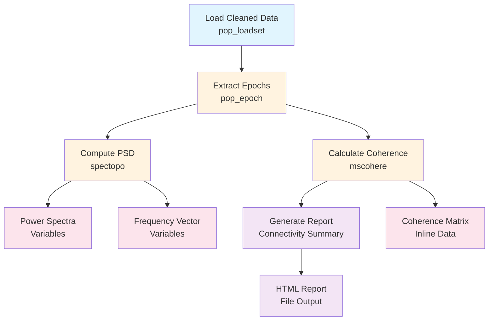

# Example: Connectivity Analysis (EEGLAB)

This page explains the [`connectivity_analysis_pipeline_eeglab.signalJourney.json`](https://github.com/neuromechanist/signalJourney/blob/main/schema/examples/connectivity_analysis_pipeline_eeglab.signalJourney.json) example file, which documents spectral connectivity analysis using EEGLAB and MATLAB functions.

## Pipeline Overview

This EEGLAB pipeline demonstrates connectivity analysis for examining relationships between EEG channels:
- **Load cleaned data** from ICA decomposition pipeline  
- **Extract epochs** for connectivity analysis
- **Compute power spectral density** using EEGLAB's `spectopo`
- **Calculate coherence matrix** using MATLAB Signal Processing Toolbox
- **Generate connectivity report** with network visualizations

## Pipeline Flowchart



## Key EEGLAB Features

### Connectivity Functions
- **`spectopo`**: EEGLAB's power spectral density computation
- **`mscohere`**: MATLAB's magnitude-squared coherence function
- **Custom functions**: Network analysis and visualization integration
- **Report generation**: Automated connectivity analysis summaries

### signalJourney Documentation
- **Cross-software integration**: EEGLAB + MATLAB Signal Processing Toolbox
- **Matrix data preservation**: Coherence matrices saved as inline data
- **Quality metrics**: Connectivity strength and significance measures

## Example JSON Structure

```json
{
  "stepId": "4",
  "name": "Calculate Coherence Matrix",
  "software": {
    "name": "MATLAB Signal Processing Toolbox",
    "version": "9.1",
    "functionCall": "coh_matrix = compute_coherence_matrix(EEG.data, EEG.srate, [8 13])"
  },
  "parameters": {
    "frequency_band": [8, 13],
    "window_length": 512,
    "overlap": 256,
    "nfft": 512
  },
  "outputTargets": [
    {
      "targetType": "inlineData",
      "name": "coherence_matrix",
      "data": "{{alpha_coherence_matrix}}",
      "description": "Alpha band coherence connectivity matrix"
    }
  ]
}
```

## EEGLAB vs MNE-Python Comparison

| Aspect | EEGLAB Version | MNE-Python Version |
|--------|----------------|-------------------|
| **Connectivity** | mscohere + custom functions | MNE-Connectivity package |
| **Frequency Analysis** | `spectopo` | `welch`, `multitaper` |
| **Data Structure** | EEGLAB EEG structure | MNE Epochs object |
| **Visualization** | MATLAB plotting | matplotlib integration |
| **Output Format** | .mat files | .h5, NetCDF files |

## Advanced Features

### Cross-Software Documentation
This example demonstrates how signalJourney can document workflows that span multiple software packages:
- EEGLAB for data handling and preprocessing
- MATLAB Signal Processing Toolbox for connectivity
- Custom functions for analysis and visualization

### Quality Control Integration
- **Connectivity thresholds**: Automatic significance testing
- **Network metrics**: Node degree, clustering coefficients
- **Visualization**: Network graphs and connectivity matrices

## Usage Notes

This example demonstrates:
- **Multi-software workflows** combining EEGLAB and MATLAB toolboxes
- **Connectivity analysis documentation** with complete parameter sets
- **Matrix data preservation** using inline data features
- **Quality control integration** for connectivity validation

The pipeline showcases signalJourney's flexibility in documenting complex analysis workflows that integrate multiple software tools while maintaining complete parameter transparency. 