# Example: Connectivity Analysis (EEGLAB)

This page explains the [`connectivity_analysis_pipeline_eeglab.signalJourney.json`](https://github.com/neuromechanist/signalJourney/blob/main/schema/examples/connectivity_analysis_pipeline_eeglab.signalJourney.json) example file, which documents spectral connectivity analysis using EEGLAB and MATLAB functions.

## Pipeline Overview

This EEGLAB pipeline demonstrates connectivity analysis for examining relationships between EEG channels:
- **Load cleaned data** from ICA decomposition pipeline  
- **Extract epochs** for connectivity analysis
- **Compute power spectral density** using EEGLAB's `spectopo`
- **Calculate coherence matrix** using MATLAB Signal Processing Toolbox
- **Generate connectivity report** with network visualizations

## Pipeline Flowchart

```mermaid
flowchart TD
    A[Load Cleaned Data<br/>pop_loadset] --> B[Extract Epochs<br/>pop_epoch]
    B --> C[Compute PSD<br/>spectopo]
    C --> D[Calculate Coherence<br/>mscohere]
    D --> E[Generate Network Plot<br/>topoplot_connect]
    E --> F[Save Results<br/>save]
    
    %% Input from ICA pipeline
    G["📁 sub-01_task-rest_desc-cleaned_eeg.set<br/>From: ICA Decomposition Pipeline"] --> A
    
    %% Intermediate outputs  
    A --> A1["📊 EEG Structure<br/>ICA-cleaned dataset"]
    B --> B1["📊 EEG Structure<br/>Epoched data"]
    C --> C1["📊 PSD Matrix<br/>Power spectral density"]
    D --> D1["📊 Coherence Matrix<br/>64×64 connectivity"]
    
    %% Analysis parameters
    B --> V1["📈 Epoch Windows<br/>[-1.0, 2.0] s"]
    C --> V2["📈 Frequency Range<br/>Alpha: 8-12 Hz"]
    D --> V3["📈 Coherence Method<br/>MATLAB mscohere"]
    
    %% Final outputs
    F --> H["💾 sub-01_task-rest_desc-connectivity_eeg.mat<br/>Connectivity results"]
    E --> I["💾 sub-01_task-rest_desc-network_plot.fig<br/>Network visualization"]
    E --> J["💾 sub-01_task-rest_desc-connectivity_matrix.png<br/>Matrix plot"]
    
    %% Quality metrics
    C --> Q1["📈 Frequency bins: 256<br/>Spectral resolution: 0.25 Hz"]
    D --> Q2["📈 Significant pairs: 312/2016<br/>Max coherence: 0.78"]

    %% Styling
    classDef processStep fill:#e1f5fe,stroke:#01579b,stroke-width:2px
    classDef inputFile fill:#fff3e0,stroke:#e65100,stroke-width:2px
    classDef outputFile fill:#e8f5e8,stroke:#1b5e20,stroke-width:2px
    classDef inMemoryData fill:#e3f2fd,stroke:#1565c0,stroke-width:1px
    classDef inlineData fill:#f3e5f5,stroke:#4a148c,stroke-width:1px
    classDef qualityMetric fill:#f9f9f9,stroke:#666,stroke-width:1px

    class A,B,C,D,E,F processStep
    class G inputFile
    class H,I,J outputFile
    class A1,B1,C1,D1 inMemoryData
    class V1,V2,V3 inlineData
    class Q1,Q2 qualityMetric
```



## Key EEGLAB Features Demonstrated

### EEGLAB Connectivity Functions
- **`pop_epoch`**: Extract event-related epochs from continuous data
- **`spectopo`**: Power spectral density computation with multitaper method
- **`mscohere`**: MATLAB coherence calculation between channel pairs
- **`topoplot_connect`**: Network visualization on scalp topography
- **MATLAB integration**: Leveraging Signal Processing Toolbox functions

### EEGLAB-Specific Parameters
- **Epoch extraction**: EEGLAB event-based epoching with GUI support
- **Spectral analysis**: Integrated with EEGLAB channel structure
- **Visualization**: EEGLAB topographic plotting with connectivity overlays
- **File formats**: MATLAB .mat files for connectivity matrices

## Example JSON Structure

The EEGLAB coherence computation demonstrates MATLAB integration:

```json
{
  "stepId": "4",
  "name": "Calculate Coherence Matrix",
  "description": "Compute magnitude-squared coherence between all channel pairs using MATLAB mscohere.",
  "software": {
    "name": "MATLAB",
    "version": "R2023a",
    "functionCall": "for i=1:64; for j=1:64; [coh,f] = mscohere(epochs(i,:), epochs(j,:), window, noverlap, nfft, srate); end; end"
  },
  "parameters": {
    "window": "hann(128)",
    "noverlap": 64,
    "nfft": 256,
    "srate": 500,
    "freq_range": [8, 12]
  }
}
```

### EEGLAB Dataset Integration
EEGLAB connectivity analysis leverages the EEG structure:

```json
{
  "stepId": "3",
  "name": "Compute Power Spectral Density",
  "software": {
    "name": "EEGLAB",
    "version": "2023.1",
    "functionCall": "[spectra,freqs] = spectopo(EEG.data, 0, EEG.srate, 'freqrange', [1 40], 'electrodes', 'on')"
  },
  "parameters": {
    "freqrange": [1, 40],
    "electrodes": "on",
    "overlap": 50,
    "nfft": 256,
    "winsize": 128
  }
}
```

## EEGLAB Connectivity Features

### MATLAB Signal Processing Integration
- **mscohere function**: Magnitude-squared coherence with Welch's method
- **Cross-spectral density**: Full spectral analysis capabilities
- **Windowing options**: Hann, Hamming, Bartlett windows
- **Frequency resolution**: Configurable FFT parameters

### EEGLAB Visualization Tools
- **topoplot integration**: Connectivity overlaid on channel locations
- **Channel location support**: 3D electrode positions for accurate plotting
- **Network graphs**: Node-edge representations of connectivity
- **Matrix visualization**: Heatmaps and connectivity matrices

### Quality Control Features
- **Spectral validation**: Power spectral density verification
- **Coherence thresholds**: Statistical significance testing
- **Channel quality**: Bad channel identification and exclusion
- **Epoch rejection**: Artifact-contaminated epoch removal

## EEGLAB vs MNE-Python Comparison

| Aspect | EEGLAB Version | MNE-Python Version |
|--------|----------------|-------------------|
| **Coherence Function** | `mscohere` (MATLAB) | `spectral_connectivity_epochs` |
| **PSD Computation** | `spectopo` | `compute_psd()` |
| **Visualization** | `topoplot_connect` | matplotlib/mayavi |
| **File Format** | .mat files | HDF5, NPZ |
| **Integration** | MATLAB ecosystem | Python ecosystem |
| **GUI Support** | Built-in EEGLAB GUI | Command-line focused |

## EEGLAB-Specific Workflow

### MATLAB Ecosystem Integration
EEGLAB connectivity analysis benefits from:
1. **Signal Processing Toolbox**: Professional-grade spectral analysis functions
2. **Parallel Computing**: Multi-core coherence computation 
3. **Visualization Tools**: Advanced plotting and 3D visualization
4. **Statistical Toolbox**: Comprehensive statistical testing capabilities

### EEG Structure Preservation
- **Channel information**: Electrode locations automatically used
- **Event markers**: Epoch extraction based on EEG.event structure
- **Sampling rate**: Automatically extracted from EEG.srate
- **Data history**: Processing steps recorded in EEG.history

### Interactive Analysis
- **GUI integration**: Pop-up functions for parameter selection
- **Visual feedback**: Real-time plotting during analysis
- **Manual adjustment**: Interactive parameter tuning
- **Batch processing**: Automated analysis across multiple datasets

## Usage Notes

This example demonstrates:
- **EEGLAB connectivity workflows** using MATLAB integration
- **Spectral analysis integration** with EEGLAB functions
- **Multi-format outputs** for matrices and visualizations
- **Quality control** with spectral validation
- **MATLAB ecosystem** leveraging Signal Processing Toolbox

The pipeline showcases EEGLAB's connectivity analysis capabilities through MATLAB integration while maintaining comprehensive parameter documentation for reproducible network analysis. The combination of EEGLAB's EEG-specific tools with MATLAB's signal processing functions provides a powerful framework for connectivity research. 