# Example: Connectivity Analysis (MNE-Python)

This page explains the [`connectivity_analysis_pipeline_mne.signalJourney.json`](https://github.com/neuromechanist/signalJourney/blob/main/schema/examples/connectivity_analysis_pipeline_mne.signalJourney.json) example file, which documents a functional connectivity analysis workflow. This pipeline calculates spectral coherence between EEG sensors using the MNE-Python and SciPy libraries.

## Pipeline Overview

This MNE-Python pipeline demonstrates connectivity analysis:
- **Load cleaned data** from ICA decomposition pipeline
- **Extract epochs** for connectivity analysis
- **Compute power spectral density** for individual channels
- **Calculate coherence matrix** between channel pairs
- **Generate connectivity report** with visualization

## Pipeline Flowchart

```mermaid
flowchart TD
    A[Load Cleaned Data<br/>mne.io.read_raw_fif] --> B[Extract Epochs<br/>mne.Epochs]
    B --> C[Compute PSD<br/>epochs.compute_psd]
    C --> D[Calculate Coherence<br/>mne.connectivity.spectral_connectivity_epochs]
    D --> E[Generate Report<br/>connectivity_report]
    
    %% Input file
    F["📁 sub-01_task-rest_desc-cleaned_eeg.fif<br/>From: ICA Decomposition Pipeline"] --> A
    
    %% Inline data
    B --> V1["📊 Event Windows<br/>[-0.5, 1.5] s"]
    C --> V2["📊 Frequency Bands<br/>Alpha: 8-12 Hz"]
    D --> V3["📊 Connectivity Method<br/>Coherence (magnitude)"]
    
    %% Final outputs
    E --> G["💾 sub-01_task-rest_desc-connectivity_eeg.h5<br/>Connectivity matrix"]
    E --> H["💾 sub-01_task-rest_desc-connectivity_plot.png<br/>Connectivity visualization"]
    
    %% Quality metrics
    C --> Q1["📈 Frequency resolution: 0.5 Hz<br/>Spectral range: 1-40 Hz"]
    D --> Q2["📈 Significant connections: 245/2016<br/>Mean coherence: 0.32"]

    %% Styling
    classDef processStep fill:#e1f5fe,stroke:#01579b,stroke-width:2px
    classDef inputFile fill:#fff3e0,stroke:#e65100,stroke-width:2px
    classDef outputFile fill:#e8f5e8,stroke:#1b5e20,stroke-width:2px
    classDef inlineData fill:#f3e5f5,stroke:#4a148c,stroke-width:1px
    classDef qualityMetric fill:#f9f9f9,stroke:#666,stroke-width:1px

    class A,B,C,D,E processStep
    class F inputFile
    class G,H outputFile
    class V1,V2,V3 inlineData
    class Q1,Q2 qualityMetric
```



## Key MNE-Python Features Demonstrated

### Connectivity Functions
- **`mne.Epochs`**: Extract task-related epochs for connectivity analysis
- **`epochs.compute_psd`**: Calculate power spectral density using multitaper method
- **`mne.connectivity.spectral_connectivity_epochs`**: Compute spectral connectivity measures
- **Connectivity metrics**: Coherence, PLI, PLV, and other measures

### Advanced Parameters
- **Frequency bands**: Specific frequency ranges for connectivity analysis
- **Connectivity methods**: Multiple algorithms for different connectivity aspects
- **Statistical testing**: Permutation tests for connectivity significance
- **Visualization**: Network plots and connectivity matrices

## Example JSON Structure

The connectivity computation demonstrates advanced parameter documentation:

```json
{
  "stepId": "4",
  "name": "Calculate Spectral Coherence",
  "description": "Compute coherence between all channel pairs in alpha band.",
  "software": {
    "name": "MNE-Python",
    "version": "1.6.1",
    "functionCall": "mne.connectivity.spectral_connectivity_epochs(epochs, method='coh', fmin=8, fmax=12)"
  },
  "parameters": {
    "method": "coh",
    "fmin": 8,
    "fmax": 12,
    "sfreq": 1000,
    "n_jobs": 1,
    "verbose": false
  }
}
```

### Multi-Output Connectivity Analysis
Connectivity analysis typically produces multiple related outputs:

```json
"outputTargets": [
  {
    "targetType": "file",
    "location": "./derivatives/signaljourney/sub-01/eeg/sub-01_task-rest_desc-connectivity_eeg.h5",
    "format": "HDF5",
    "description": "Connectivity matrix with channel pairs and frequency bins."
  },
  {
    "targetType": "inlineData",
    "name": "connectivity_matrix",
    "data": "{{coherence_matrix_alpha}}",
    "description": "Alpha band coherence matrix (64x64)."
  }
]
```

## Connectivity Analysis Features

### Frequency-Specific Analysis
- **Band-specific connectivity**: Focus on particular frequency ranges (alpha, beta, gamma)
- **Broadband analysis**: Connectivity across multiple frequency bands
- **Time-frequency connectivity**: Dynamic connectivity over time
- **Cross-frequency coupling**: Interactions between different frequency bands

### Connectivity Metrics
- **Coherence**: Linear relationship in frequency domain
- **Phase-Locking Value (PLV)**: Phase synchronization between signals
- **Phase Lag Index (PLI)**: Phase relationship corrected for volume conduction
- **Granger Causality**: Directed connectivity measures

### Statistical Assessment
- **Permutation testing**: Significance testing for connectivity values
- **Multiple comparison correction**: Control for multiple channel pairs
- **Confidence intervals**: Bootstrap confidence bounds for connectivity
- **Network measures**: Graph theory metrics on connectivity networks

## MNE-Python vs EEGLAB Comparison

| Aspect | MNE-Python Version | EEGLAB Version |
|--------|-------------------|----------------|
| **Methods** | Multiple algorithms | `mscohere`, coherence2 |
| **Frequency Analysis** | `compute_psd()` | `spectopo` |
| **Statistical Testing** | Built-in permutations | External testing |
| **Visualization** | matplotlib/mayavi | EEGLAB plots |
| **Output Format** | HDF5, NPZ | .mat files |

## Usage Notes

This example demonstrates:
- **Connectivity analysis workflows** with frequency-specific measures
- **Statistical testing integration** for significance assessment
- **Multi-output documentation** for matrices and visualizations
- **Quality metrics** for connectivity analysis validation
- **Pipeline integration** building on previous processing steps

The pipeline showcases MNE-Python's comprehensive connectivity analysis capabilities while maintaining full parameter transparency for reproducible network analysis. 