# Example: ICA Decomposition Pipeline

This page explains the [`ica_decomposition_pipeline.signalJourney.json`](https://github.com/neuromechanist/signalJourney/blob/main/schema/examples/ica_decomposition_pipeline.signalJourney.json) example file, which documents an Independent Component Analysis (ICA) workflow for artifact removal using MNE-Python.

## Pipeline Overview

This pipeline demonstrates how to apply ICA to remove ocular artifacts (eye movements and blinks) from preprocessed EEG data. It builds upon the [Basic Preprocessing Pipeline](./basic_preprocessing.md) by:

- **Loading preprocessed data** from the previous pipeline
- **Fitting ICA decomposition** using FastICA algorithm
- **Identifying artifact components** correlated with EOG channels
- **Removing artifact components** and saving cleaned data

## Pipeline Flowchart

```mermaid
flowchart TD
    A["1. Load Preprocessed Data<br/>'read_raw_fif'"] --> B["2. Fit ICA<br/>'ICA.fit(FastICA)'"]
    B --> C["3. Find EOG Components<br/>'find_bads_eog'"]
    C --> D["4. Apply ICA (Remove Components)<br/>'ica.apply'"]

    %% Input from previous pipeline
    E["📁 sub-01_task-rest_desc-preproc_eeg.fif<br/>From: Basic EEG Preprocessing v1.0.0"] --> A
    
    %% Intermediate outputs
    B --> B1["📊 ICA Object<br/>15 components"]
    C --> C1["📊 EOG Indices<br/>[0, 3]"]
    C --> C2["📊 EOG Scores<br/>[99, 85]"]
    
    %% Final output
    D --> F["💾 sub-01_task-rest_desc-cleaned_eeg.fif<br/>ICA-cleaned data"]

    %% Styling
    classDef processStep fill:#e1f5fe,stroke:#01579b,stroke-width:2px
    classDef inputFile fill:#fff3e0,stroke:#e65100,stroke-width:2px
    classDef outputFile fill:#e8f5e8,stroke:#1b5e20,stroke-width:2px
    classDef inlineData fill:#f3e5f5,stroke:#4a148c,stroke-width:1px

    class A,B,C,D processStep
    class E inputFile
    class F outputFile
    class B1,C1,C2 inlineData
```



## Key signalJourney Features Demonstrated

### 1. Pipeline Source Tracking

This example shows how to link outputs from previous pipelines:

```json
{
  "stepId": "1",
  "name": "Load Preprocessed Data",
  "inputSources": [
    {
      "sourceType": "file",
      "location": "./derivatives/signaljourney/sub-01/eeg/sub-01_task-rest_desc-preproc_eeg.fif",
      "entityLabels": {
        "sub": "01",
        "task": "rest",
        "desc": "preproc"
      },
      "pipelineSource": { 
        "pipelineName": "Basic EEG Preprocessing",
        "pipelineVersion": "1.0.0"
      }
    }
  ]
}
```

The `pipelineSource` field creates **traceability** between processing stages, enabling:
- **Provenance tracking** (knowing exactly where data came from)
- **Version compatibility** (ensuring pipeline versions match)
- **Dependency management** (understanding pipeline relationships)

### 2. Multiple Output Types

Step 2 demonstrates different output types from a single processing step:

```json
{
  "stepId": "2",
  "name": "Fit ICA",
  "outputTargets": [
    {
      "targetType": "in-memory",
      "format": "mne.preprocessing.ICA",
      "description": "Fitted ICA object."
    },
    {
      "targetType": "inlineData",
      "format": "mne.preprocessing.ICA",
      "description": "Fitted ICA object.",
      "data": [[1,2,3,4,5,6,7,8,9,10,11,12,13,14,15],[1,2,3,4,5,6,7,8,9,10,11,12,13,14,15]]
    }
  ]
}
```

This shows:
- **In-memory objects** for pipeline continuation
- **Inline data** for result preservation and inspection

### 3. Variable Outputs and Cross-Step References

Step 3 produces variables that are consumed by Step 4:

**Step 3 outputs:**
```json
"outputTargets": [
  {
    "targetType": "variable",
    "name": "eog_indices",
    "description": "Indices of identified EOG components."
  },
  {
    "targetType": "inlineData",
    "name": "eog_indices",
    "data": [0, 3]
  },
  {
    "targetType": "variable",
    "name": "eog_scores",
    "description": "Scores associated with EOG components."
  },
  {
    "targetType": "inlineData",
    "name": "eog_scores",
    "data": [99, 85]
  }
]
```

**Step 4 inputs:**
```json
"inputSources": [
  {
    "sourceType": "previousStepOutput",
    "stepId": "1",
    "outputId": "Loaded preprocessed data object."
  },
  {
    "sourceType": "previousStepOutput",
    "stepId": "2",
    "outputId": "Fitted ICA object."
  },
  {
    "sourceType": "previousStepOutput",
    "stepId": "3",
    "outputId": "Indices of identified EOG components."
  }
]
```

This demonstrates **complex data dependencies** where multiple previous outputs feed into subsequent steps.

### 4. Algorithm-Specific Parameters

The ICA fitting step shows detailed algorithm configuration:

```json
{
  "stepId": "2",
  "name": "Fit ICA",
  "software": {
    "name": "MNE-Python",
    "version": "1.6.1",
    "functionCall": "ica = mne.preprocessing.ICA(n_components=15, method='fastica', random_state=97, max_iter='auto'); ica.fit(raw, picks='eeg')"
  },
  "parameters": {
    "n_components": 15,
    "method": "fastica",
    "random_state": 97,
    "max_iter": "auto",
    "fit_params": {
      "picks": "eeg"
    }
  }
}
```

This preserves:
- **Exact software versions** for reproducibility
- **Complete parameter sets** including nested options
- **Literal function calls** for implementation reference

### 5. Quality Metrics at Multiple Levels

Quality metrics are captured at both step and pipeline levels:

**Step-level metrics:**
```json
"qualityMetrics": {
  "eogComponentsIdentified": [0, 3],
  "numEogComponents": 2
}
```

**Pipeline-level metrics:**
```json
"summaryMetrics": {
  "numIcaComponents": 15,
  "numArtifactComponentsRemoved": 2
}
```

## Advanced signalJourney Patterns

This example demonstrates several advanced patterns:

### Multi-Input Dependencies
Step 4 depends on outputs from three previous steps, showing how complex data flows can be captured.

### Algorithm Selection Documentation
The choice of FastICA is explicitly documented with all parameters, enabling exact reproduction.

### Artifact Classification Workflow
The two-step process (identification → removal) is clearly separated, allowing for inspection and validation of artifact detection.

### Cross-Pipeline Integration
The pipeline source tracking creates a clear lineage from raw data through preprocessing to artifact removal.

## Usage in Research Workflows

This ICA pipeline example shows how signalJourney supports:

1. **Modular pipeline design** - Each stage can be developed and validated independently
2. **Parameter sensitivity analysis** - All settings are preserved for comparison across runs
3. **Quality control** - Intermediate results are available for inspection
4. **Reproducible research** - Complete provenance chain is maintained
5. **Collaborative workflows** - Clear interfaces between processing stages

The combination of detailed parameter tracking, multi-level outputs, and provenance links makes this example particularly valuable for research applications where transparency and reproducibility are essential. 