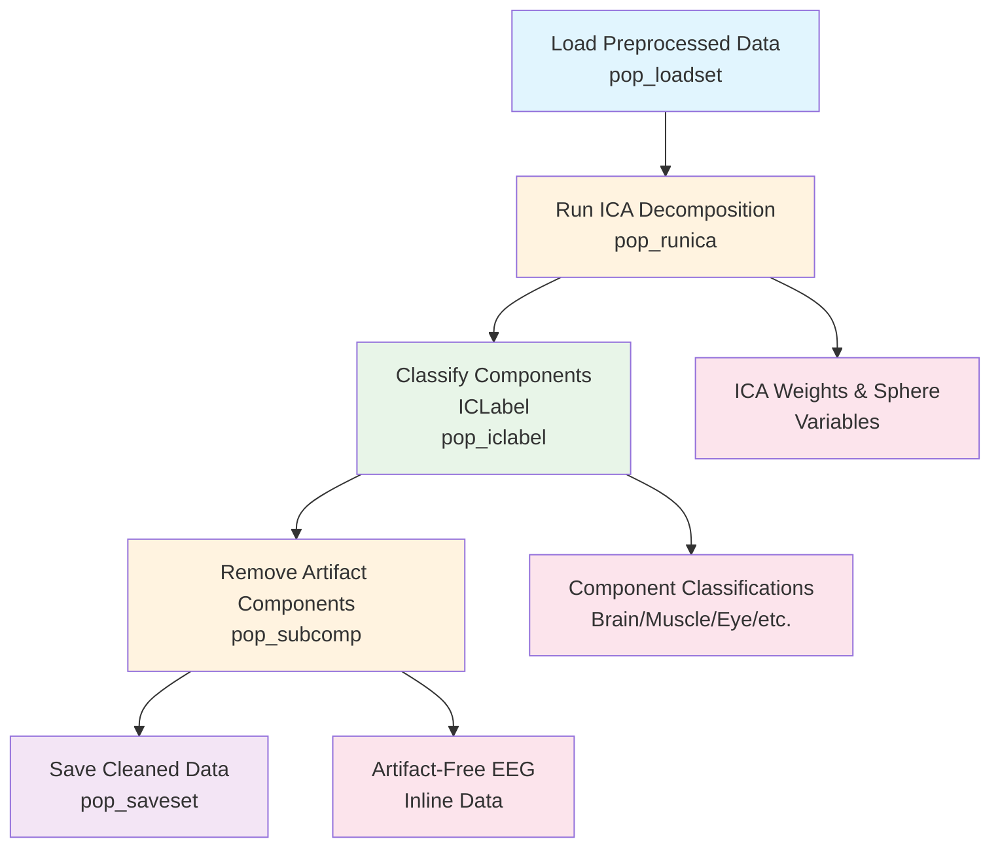

# Example: ICA Decomposition Pipeline (EEGLAB)

This page explains the [`ica_decomposition_pipeline_eeglab.signalJourney.json`](https://github.com/neuromechanist/signalJourney/blob/main/schema/examples/ica_decomposition_pipeline_eeglab.signalJourney.json) example file, which documents an Independent Component Analysis (ICA) workflow for artifact removal using EEGLAB.

## Pipeline Overview

This EEGLAB pipeline demonstrates how to apply ICA to remove artifacts from preprocessed EEG data using EEGLAB's ICA functions and ICLabel for component classification:

- **Loading preprocessed data** from the basic preprocessing pipeline
- **Computing ICA decomposition** using extended Infomax algorithm
- **Classifying components** with ICLabel to identify artifacts
- **Removing artifact components** from the data
- **Saving cleaned data** for further analysis

## Pipeline Flowchart



## Key EEGLAB Features Demonstrated

### ICA-Specific Functions
- **`pop_runica`**: Extended Infomax ICA decomposition
- **`pop_iclabel`**: Automated component classification
- **`pop_subcomp`**: Remove components from EEG data
- **ICLabel integration**: Brain vs. artifact classification

### Advanced signalJourney Features
- **Variable storage**: ICA weights and sphere matrices
- **Inline data preservation**: Component timecourses and topographies
- **Quality metrics**: Classification probabilities and removal statistics
- **Multi-output steps**: Steps generating both files and variables

## Example JSON Structure

The ICA decomposition step demonstrates complex output documentation:

```json
{
  "stepId": "2",
  "name": "Run ICA Decomposition",
  "description": "Compute ICA decomposition using extended Infomax algorithm.",
  "software": {
    "name": "EEGLAB",
    "version": "2023.1",
    "functionCall": "pop_runica(EEG, 'icatype', 'runica', 'extended', 1, 'interupt', 'off')"
  },
  "parameters": {
    "icatype": "runica",
    "extended": 1,
    "interrupt": "off",
    "pca": null
  },
  "outputTargets": [
    {
      "targetType": "variable",
      "name": "ica_weights",
      "description": "ICA unmixing matrix."
    },
    {
      "targetType": "inlineData",
      "name": "component_topographies",
      "data": "{{ica_component_maps}}",
      "description": "ICA component scalp topographies"
    }
  ]
}
```

### ICLabel Component Classification
The ICLabel step showcases automated artifact classification:

```json
{
  "qualityMetrics": {
    "brain_components": "{{num_brain_components}}",
    "muscle_components": "{{num_muscle_components}}",
    "eye_components": "{{num_eye_components}}",
    "heart_components": "{{num_heart_components}}",
    "line_noise_components": "{{num_line_noise_components}}",
    "channel_noise_components": "{{num_channel_noise_components}}",
    "other_components": "{{num_other_components}}"
  }
}
```

## EEGLAB vs MNE-Python Comparison

| Aspect | EEGLAB Version | MNE-Python Version |
|--------|----------------|-------------------|
| **ICA Algorithm** | Extended Infomax (`runica`) | FastICA, Infomax |
| **Classification** | ICLabel (automated) | Manual inspection |
| **Component Removal** | `pop_subcomp` | `apply()` method |
| **Visualization** | Built-in component plots | Custom plotting |
| **Integration** | Seamless EEGLAB workflow | Requires additional steps |

## Advanced Features

### Component Classification Workflow
1. **Automated Classification**: ICLabel provides probability scores for each component type
2. **Threshold-Based Selection**: Components automatically flagged based on classification confidence
3. **Quality Assurance**: Detailed metrics on component types and removal decisions

### Data Provenance
- **Pipeline Dependencies**: Clear links to preprocessing steps
- **Parameter Tracking**: Complete ICA algorithm parameters
- **Component Documentation**: Full record of which components were removed and why

## Usage Notes

This example demonstrates:
- **Advanced EEGLAB workflows** with ICA and artifact removal
- **Automated component classification** using ICLabel
- **Complex data documentation** with multiple output types
- **Quality control integration** for artifact removal validation

The pipeline showcases signalJourney's ability to document sophisticated processing workflows while maintaining the flexibility needed for various EEGLAB analysis approaches. 