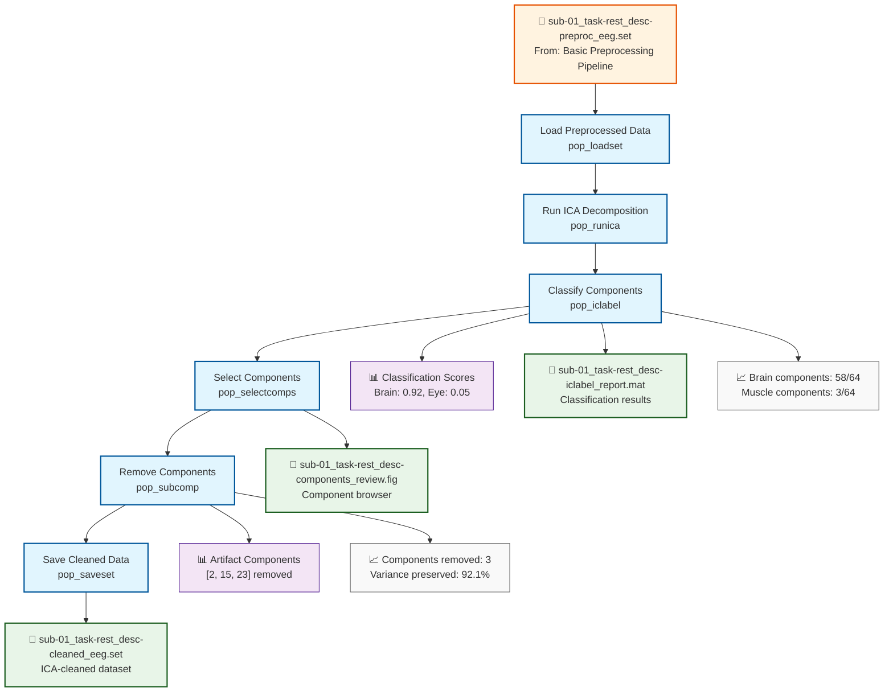

# Example: ICA Decomposition Pipeline (EEGLAB)

This page explains the [`ica_decomposition_pipeline_eeglab.signalJourney.json`](https://github.com/neuromechanist/signalJourney/blob/main/schema/examples/ica_decomposition_pipeline_eeglab.signalJourney.json) example file, which documents an Independent Component Analysis (ICA) workflow for artifact removal using EEGLAB.

## Pipeline Overview

This EEGLAB pipeline demonstrates how to apply ICA to remove artifacts from preprocessed EEG data using EEGLAB's ICA functions and ICLabel for component classification:

- **Loading preprocessed data** from the basic preprocessing pipeline
- **Computing ICA decomposition** using extended Infomax algorithm
- **Classifying components** with ICLabel to identify artifacts
- **Removing artifact components** from the data
- **Saving cleaned data** for further analysis

## Pipeline Flowchart



## Key EEGLAB Features Demonstrated

### ICA-Specific Functions
- **`pop_runica`**: Extended Infomax ICA decomposition
- **`pop_iclabel`**: Automated component classification using deep learning
- **`pop_selectcomps`**: Interactive component selection interface
- **`pop_subcomp`**: Remove components from EEG data
- **ICLabel integration**: Brain vs. artifact classification with probability scores

### EEGLAB-Specific Parameters
- **Extended Infomax**: Natural gradient algorithm for ICA
- **ICLabel classification**: Automated artifact detection using trained models
- **Interactive selection**: GUI-based component review and selection
- **Dataset integration**: Seamless EEGLAB structure preservation

## Example JSON Structure

The ICA decomposition step demonstrates complex output documentation:

```json
{
  "stepId": "2",
  "name": "Run ICA Decomposition",
  "description": "Compute ICA decomposition using extended Infomax algorithm.",
  "software": {
    "name": "EEGLAB",
    "version": "2023.1",
    "functionCall": "pop_runica(EEG, 'icatype', 'runica', 'extended', 1, 'interrupt', 'off')"
  },
  "parameters": {
    "icatype": "runica",
    "extended": 1,
    "interrupt": "off",
    "pca": null,
    "lrate": 0.001,
    "maxsteps": 500,
    "stop": 1e-7
  }
}
```

### ICLabel Component Classification
The ICLabel step showcases automated artifact classification:

```json
{
  "stepId": "3", 
  "name": "Classify Components with ICLabel",
  "description": "Automatically classify ICA components using ICLabel deep learning model.",
  "software": {
    "name": "EEGLAB",
    "version": "2023.1",
    "functionCall": "EEG = pop_iclabel(EEG, 'default')"
  },
  "qualityMetrics": {
    "brain_components": 58,
    "muscle_components": 3,
    "eye_components": 2,
    "heart_components": 0,
    "line_noise_components": 1,
    "channel_noise_components": 0,
    "other_components": 0
  }
}
```

### Advanced signalJourney Features
- **Variable storage**: ICA weights and sphere matrices
- **Inline data preservation**: Component timecourses and topographies
- **Quality metrics**: Classification probabilities and removal statistics
- **Multi-output steps**: Steps generating both files and variables

## EEGLAB ICA Workflow

### Extended Infomax Algorithm
EEGLAB's `pop_runica` provides:
- **Natural gradient optimization**: Efficient convergence for EEG data
- **Extended model**: Handles both sub- and super-Gaussian sources
- **Robust convergence**: Adaptive learning rate and stopping criteria
- **Reproducible results**: Fixed random seed options

### ICLabel Classification System
- **Deep learning model**: Trained on thousands of manually labeled components
- **Multiple artifact types**: Brain, muscle, eye, heart, line noise, channel noise
- **Probability scores**: Confidence levels for each classification
- **Automatic thresholding**: Configurable probability thresholds for removal

### Interactive Component Review
- **Visual inspection**: Component topographies, time courses, and spectra
- **Classification overlay**: ICLabel probabilities displayed for each component
- **Manual override**: User can override automatic classifications
- **Batch selection**: Tools for selecting multiple components efficiently

## EEGLAB vs MNE-Python Comparison

| Aspect | EEGLAB Version | MNE-Python Version |
|--------|----------------|-------------------|
| **Algorithm** | Extended Infomax (runica) | FastICA, Infomax, Picard |
| **Classification** | ICLabel (automated) | Manual inspection + correlation |
| **Component Removal** | `pop_subcomp` | `ica.apply()` |
| **Visualization** | Built-in component plots | Custom plotting functions |
| **Integration** | Seamless EEGLAB workflow | Object-oriented approach |
| **Automation** | Highly automated | Semi-automatic workflow |

## Advanced Features

### Component Classification Workflow
1. **Automated Classification**: ICLabel provides probability scores for each component type
2. **Threshold-Based Selection**: Components automatically flagged based on classification confidence
3. **Quality Assurance**: Detailed metrics on component types and removal decisions
4. **Manual Review**: Interactive interface for validation and adjustment

### Data Provenance and Quality Control
- **Pipeline Dependencies**: Clear links to preprocessing steps
- **Parameter Tracking**: Complete ICA algorithm parameters
- **Component Documentation**: Full record of which components were removed and why
- **Classification Confidence**: Probability scores for reproducibility

### EEGLAB Dataset Integration
- **Structure Preservation**: EEG structure maintained throughout processing
- **History Tracking**: All operations recorded in EEG.history
- **Compatibility**: Works seamlessly with other EEGLAB functions
- **STUDY Integration**: Results compatible with group-level analysis

## Usage Notes

This example demonstrates:
- **Advanced EEGLAB workflows** with ICA and automated artifact classification
- **ICLabel integration** for objective component classification
- **Complex data documentation** with multiple output types
- **Quality control integration** for comprehensive artifact removal validation
- **Interactive workflow support** with manual review capabilities

The pipeline showcases signalJourney's ability to document sophisticated processing workflows while maintaining the flexibility needed for various EEGLAB analysis approaches. The combination of automated classification and manual review provides a robust framework for artifact removal that balances efficiency with quality control. 