# Example: ICA Decomposition Pipeline (MNE-Python)

This page explains the [`ica_decomposition_pipeline_mne.signalJourney.json`](https://github.com/neuromechanist/signalJourney/blob/main/schema/examples/ica_decomposition_pipeline_mne.signalJourney.json) example file, which documents an Independent Component Analysis (ICA) workflow for artifact removal using MNE-Python.

## Pipeline Overview

This pipeline demonstrates how to apply ICA to remove ocular artifacts (eye movements and blinks) from preprocessed EEG data. It builds upon the [Basic Preprocessing Pipeline](./basic_preprocessing_mne.md) by:

- **Loading preprocessed data** from the previous pipeline
- **Fitting ICA decomposition** using FastICA algorithm
- **Identifying artifact components** correlated with EOG channels
- **Removing artifact components** from the data
- **Saving cleaned data** for further analysis

## Pipeline Flowchart

```mermaid
flowchart TD
    A[Load Preprocessed Data<br/>mne.io.read_raw_fif] --> B[Fit ICA<br/>ica.fit]
    B --> C[Find EOG Components<br/>ica.find_bads_eog]
    C --> D[Review Components<br/>ica.plot_components]
    D --> E[Apply ICA<br/>ica.apply]
    E --> F[Save Cleaned Data<br/>raw.save]
    
    %% Input from basic preprocessing
    G["📁 sub-01_task-rest_desc-preproc_eeg.fif<br/>From: Basic Preprocessing Pipeline"] --> A
    
    %% Intermediate outputs
    A --> A1["📊 Raw Object<br/>Preprocessed data"]
    B --> B1["📊 ICA Object<br/>64 components fitted"]
    C --> C1["📊 Component List<br/>EOG artifact indices"]
    D --> D1["📊 Component Plot<br/>Topographies & time series"]
    
    %% Analysis data
    B --> V1["📊 Unmixing Matrix<br/>64×64 ICA weights"]
    C --> V2["📊 EOG Correlations<br/>r > 0.7 threshold"]
    C --> V3["📈 Bad Components<br/>[0, 15, 23] identified"]
    
    %% Final outputs
    F --> H["💾 sub-01_task-rest_desc-cleaned_eeg.fif<br/>ICA-cleaned data"]
    D --> I["💾 sub-01_task-rest_desc-components_plot.png<br/>Component visualization"]
    
    %% Quality metrics
    C --> Q1["📈 Components removed: 3/64<br/>Explained variance: 15.7%"]
    E --> Q2["📈 EOG correlation: 0.82<br/>SNR improvement: 4.2 dB"]

    %% Styling
    classDef processStep fill:#e1f5fe,stroke:#01579b,stroke-width:2px
    classDef inputFile fill:#fff3e0,stroke:#e65100,stroke-width:2px
    classDef outputFile fill:#e8f5e8,stroke:#1b5e20,stroke-width:2px
    classDef inMemoryData fill:#e3f2fd,stroke:#1565c0,stroke-width:1px
    classDef inlineData fill:#f3e5f5,stroke:#4a148c,stroke-width:1px
    classDef qualityMetric fill:#f9f9f9,stroke:#666,stroke-width:1px

    class A,B,C,D,E,F processStep
    class G inputFile
    class H,I outputFile
    class A1,B1,C1,D1,V1,V2 inMemoryData
    class V3 inlineData
    class Q1,Q2 qualityMetric
```



## Key MNE-Python Features Demonstrated

### ICA Functions and Methods
- **`mne.preprocessing.ICA`**: Create ICA object with FastICA algorithm
- **`ica.fit`**: Fit ICA decomposition to preprocessed data
- **`ica.find_bads_eog`**: Automatically identify EOG-correlated components
- **`ica.plot_components`**: Visualize component topographies and properties
- **`ica.apply`**: Remove identified artifact components from data

### Advanced ICA Parameters
- **Algorithm selection**: FastICA vs. Infomax vs. Picard algorithms
- **Component number**: Automatic or manual specification
- **Convergence criteria**: Tolerance and maximum iterations
- **Random state**: Reproducible decomposition results

## Example JSON Structure

The ICA fitting step demonstrates complex parameter documentation:

```json
{
  "stepId": "2",
  "name": "Fit ICA Decomposition",
  "description": "Apply FastICA to decompose data into independent components.",
  "software": {
    "name": "MNE-Python",
    "version": "1.6.1",
    "functionCall": "ica.fit(raw, picks='eeg', decim=2, reject=dict(eeg=100e-6))"
  },
  "parameters": {
    "n_components": 64,
    "algorithm": "fastica",
    "fun": "logcosh",
    "max_iter": 200,
    "tol": 1e-4,
    "w_init": null,
    "whiten": true,
    "random_state": 42
  }
}
```

### Artifact Identification Documentation
The component identification step includes correlation thresholds:

```json
{
  "stepId": "3",
  "name": "Find EOG Components",
  "description": "Identify components correlated with EOG channels.",
  "qualityMetrics": {
    "eogChannels": ["EOG001", "EOG002"],
    "correlationThreshold": 0.7,
    "componentsFound": 3,
    "maxCorrelation": 0.82,
    "explainedVariance": 15.7
  }
}
```

## ICA Analysis Features

### Component Identification Methods
- **EOG correlation**: Correlation with electrooculogram channels
- **Variance explained**: Contribution to total signal variance  
- **Topographic patterns**: Spatial distributions matching known artifacts
- **Time course properties**: Temporal characteristics of components

### Quality Assessment Metrics
- **Correlation values**: Quantify artifact-component relationships
- **Explained variance**: Component contribution to signal
- **Signal-to-noise ratio**: Improvement after component removal
- **Component stability**: Reproducibility across runs

## MNE-Python vs EEGLAB Comparison

| Aspect | MNE-Python Version | EEGLAB Version |
|--------|-------------------|----------------|
| **Algorithm** | FastICA, Infomax, Picard | Extended Infomax (runica) |
| **Identification** | `find_bads_eog()` | ICLabel classification |
| **Visualization** | `plot_components()` | `pop_selectcomps` |
| **Application** | `ica.apply()` | `pop_subcomp` |
| **Automation** | Semi-automatic | Manual + automatic |

## ICA Workflow Patterns

### Component Selection Strategy
1. **Automatic detection**: Use correlation thresholds with reference channels
2. **Visual inspection**: Review topographies and time courses
3. **Combined approach**: Automatic detection + manual verification
4. **Conservative removal**: Remove only clearly artifactual components

### Quality Control Steps
- **Component stability**: Ensure reproducible decomposition
- **Artifact effectiveness**: Verify artifact reduction in cleaned data
- **Signal preservation**: Confirm minimal neural signal loss
- **Validation metrics**: Compare before/after signal characteristics

## Usage Notes

This example demonstrates:
- **ICA workflow patterns** for artifact removal
- **Parameter documentation** for reproducible decomposition
- **Quality metrics** for component evaluation
- **Visualization integration** for manual review
- **Pipeline continuation** feeding into further analysis

The pipeline showcases MNE-Python's flexible ICA capabilities while emphasizing the importance of quality control and parameter documentation for reproducible artifact removal. 