# signalJourney Examples

Welcome to the signalJourney examples! These examples demonstrate how to document signal processing pipelines using the signalJourney specification. Each example includes a detailed breakdown of the JSON structure and showcases different features of the format.

## Example Categories

### 📚 Schema Examples
These examples are found in the [`schema/examples/`](https://github.com/signalJourney/signalJourney/tree/main/schema/examples) directory and demonstrate core signalJourney features with implementations in both MNE-Python and EEGLAB:

| Pipeline Type | MNE-Python Implementation | EEGLAB Implementation | Key Features |
|---------------|---------------------------|------------------------|--------------|
| **Basic Preprocessing** | [MNE-Python](./basic_preprocessing_mne.md) | [EEGLAB](./basic_preprocessing_eeglab.md) | File I/O, step dependencies, quality metrics |
| **ICA Decomposition** | [MNE-Python](./ica_decomposition_mne.md) | [EEGLAB](./ica_decomposition_eeglab.md) | Multi-output steps, artifact removal, variables |
| **Time-Frequency Analysis** | [MNE-Python](./time_frequency_mne.md) | [EEGLAB](./time_frequency_eeglab.md) | Wavelet decomposition, baseline correction |
| **Source Localization** | [MNE-Python](./source_localization_mne.md) | [EEGLAB](./source_localization_eeglab.md) | Forward modeling, inverse solutions |
| **Connectivity Analysis** | [MNE-Python](./connectivity_mne.md) | [EEGLAB](./connectivity_eeglab.md) | Cross-channel analysis, network metrics |

### 🔬 Real-World Examples
Production pipelines demonstrating advanced signalJourney features:

| Pipeline | Software | Description | Key Features |
|----------|----------|-------------|--------------|
| [NEMAR Pipeline](./real_world/nemar_pipeline.md) | EEGLAB/MATLAB | Complete EEG preprocessing for OpenNeuro datasets | 12-step workflow, inline data, extension schemas |

## Implementation Comparison

### Software-Specific Features

**MNE-Python Examples:**
- Object-oriented API (`epochs.filter()`, `raw.set_eeg_reference()`)
- HDF5 and FIF file formats
- Advanced source modeling (BEM, forward solutions)
- Integration with scipy/numpy ecosystem

**EEGLAB Examples:**
- Pop-up function interface (`pop_loadset`, `pop_eegfiltnew`)
- .set/.fdt file formats
- ICLabel automated component classification
- MATLAB ecosystem integration

## Learning Path Recommendations

### 🎯 For Beginners
1. Start with **Basic Preprocessing** ([MNE-Python](./basic_preprocessing_mne.md) or [EEGLAB](./basic_preprocessing_eeglab.md))
2. Understand signalJourney structure and common patterns
3. Learn about quality metrics and parameter documentation

### 🚀 For Intermediate Users
1. Explore **ICA Decomposition** examples for multi-output workflows
2. Study **Time-Frequency Analysis** for advanced parameter handling
3. Examine **Real-World Examples** for production pipeline patterns

### 🔬 For Advanced Users
1. Analyze **Source Localization** for complex dependency chains
2. Study **Connectivity Analysis** for cross-channel processing
3. Use **NEMAR Pipeline** as template for your own workflows

## Key signalJourney Features Demonstrated

| Feature | Example Categories | Description |
|---------|-------------------|-------------|
| **Step Dependencies** | All examples | `dependsOn` field linking processing steps |
| **Quality Metrics** | All examples | Step-level and summary quality assessments |
| **Multi-Output Steps** | ICA, Time-Frequency | Steps producing files, variables, and inline data |
| **Pipeline Provenance** | All examples | Links between related processing pipelines |
| **Extension Schemas** | NEMAR Pipeline | Domain-specific metadata and parameters |
| **Parameter Documentation** | All examples | Complete parameter sets for reproducibility |
| **Software Integration** | All examples | Function calls, versions, and dependencies |

## Interactive Features

Each example page includes:
- **📊 Mermaid flowcharts** showing pipeline structure
- **💻 JSON code examples** with syntax highlighting  
- **📋 Parameter explanations** for each processing step
- **🔍 Quality control** integration examples
- **🔗 Cross-references** to related examples and schemas

### Mermaid Diagram Legend

The flowcharts use a consistent color scheme to distinguish different types of elements:

```mermaid
flowchart TD
    A[Processing Step<br/>Function call] --> B[Another Step<br/>Function call]
    
    %% Input and output files  
    C["📁 input_file.fif<br/>Input data"] --> A
    B --> D["💾 output_file.fif<br/>Processed data"]
    
    %% Inline data (small parameters/values saved in JSON)
    A --> E["📊 Inline Data<br/>Small parameters/values"]
    
    %% Quality metrics
    B --> F["📈 Quality Metrics<br/>Processing statistics"]

    %% Styling
    classDef processStep fill:#e1f5fe,stroke:#01579b,stroke-width:2px
    classDef inputFile fill:#fff3e0,stroke:#e65100,stroke-width:2px
    classDef outputFile fill:#e8f5e8,stroke:#1b5e20,stroke-width:2px
    classDef inlineData fill:#f3e5f5,stroke:#4a148c,stroke-width:2px
    classDef qualityMetric fill:#f9f9f9,stroke:#666,stroke-width:1px

    class A,B processStep
    class C inputFile
    class D outputFile
    class E inlineData
    class F qualityMetric
```

**Legend:**
- **🔵 Light Blue**: Processing steps (function calls)
- **🟠 Orange**: Input files 
- **🟢 Green**: Output files (saved results)
- **🟣 Purple**: Inline data (small parameters/values stored in JSON)
- **⚪ Gray**: Quality metrics (processing statistics)

## Getting Started

1. **Choose your software**: Pick MNE-Python or EEGLAB based on your workflow
2. **Start simple**: Begin with Basic Preprocessing to understand the format
3. **Build complexity**: Progress through examples as your needs grow
4. **Adapt patterns**: Use examples as templates for your own pipelines

Each example is designed to be both educational and practical, providing patterns you can adapt for documenting your own signal processing workflows.

## JSON Schema Reference

All examples validate against the signalJourney JSON schema. For detailed field specifications, see:
- [Schema Overview](../specification/overview.md)
- [Field Definitions](../specification/fields.md)
- [Validation Guide](../specification/validation.md)

## Contributing Examples

Have a pipeline you'd like to document as an example? See our [contributing guide](../contributing.md) for how to add new examples to the collection.
