# Real-World Example: NEMAR EEG Processing Pipeline

This page documents the NEMAR (EEGLAB-based) EEG processing pipeline as represented in [`nemar_pipeline.signalJourney.json`](./nemar_pipeline.signalJourney.json). This is a **production pipeline** used to process OpenNeuro EEG datasets, demonstrating the full power of signalJourney for documenting complex, real-world workflows.

## Pipeline Overview

The NEMAR pipeline is a comprehensive EEG preprocessing workflow that processes BIDS-formatted EEG datasets using EEGLAB and its plugins. It demonstrates several advanced signalJourney features:

- **12-step processing workflow** with complex dependencies
- **Inline data preservation** for critical intermediate results
- **Comprehensive quality assessment** at multiple levels
- **Extension schema integration** for domain-specific metadata
- **Production-grade parameter documentation**

### Key Processing Stages

1. **Data Import & Validation** (Steps 1-3)
2. **Channel Selection & Preprocessing** (Steps 4-6) 
3. **Automated Artifact Rejection** (Step 7)
4. **ICA Decomposition & Classification** (Steps 8-9)
5. **Quality Assessment & Analysis** (Steps 10-11)
6. **Results Export** (Step 12)

## Pipeline Flowchart

```mermaid
flowchart TD
    A["1.Import BIDS Dataset<br/>'pop_importbids'"] --> B["2.Check Import Status"]
    B --> C["3.Check Channel Locations"]
    C --> D["4.Remove Non-EEG Channels<br/>'pop_select'"]
    D --> E["5.Remove DC Offset<br/>'pop_rmbase'"]
    E --> F["6.High-pass Filter<br/>'pop_eegfiltnew'"]
    F --> G["7.Clean Raw Data<br/>'clean_rawdata'"]
    G --> H["8.Run ICA Decomposition<br/>'runica'"]
    H --> I["9.ICLabel Classification<br/>'ICLabel'"]
    I --> J["10.Data Quality Assessment<br/>Quality metrics"]
    J --> K["11.Power Spectral Analysis<br/>Line noise assessment"]
    K --> L["12.Save Processed Dataset<br/>Final output"]

    %% Inline Data Outputs
    D --> D1["📊 removed_channels<br/>Channel list"]
    G --> G1["📊 clean_sample_mask<br/>Time samples"]
    G --> G2["📊 clean_channel_mask<br/>Channel mask"]
    G --> G3["📊 rejected_channels<br/>Rejected list"]
    H --> H1["📊 ica_weights<br/>Weight matrix"]
    H --> H2["📊 ica_sphere<br/>Sphere matrix"]
    H --> H3["📊 ica_components<br/>Activations"]
    I --> I1["📊 ic_classification<br/>Probabilities"]
    I --> I2["📊 flagged_components<br/>Artifact indices"]
    J --> J1["📊 data_quality_metrics<br/>QC measures"]
    K --> K1["📊 power_spectrum<br/>PSD data"]
    K --> K2["📊 line_noise_assessment<br/>Noise levels"]

    %% Saved File Outputs
    J --> J2["💾 dataqual.json<br/>Quality report"]
    L --> L1["💾 processed_eeg.set<br/>Final dataset"]
    L --> L2["💾 pipeline_status.csv<br/>Step status"]

    %% Styling
    classDef processStep fill:#e1f5fe,stroke:#01579b,stroke-width:2px
    classDef inlineData fill:#f3e5f5,stroke:#4a148c,stroke-width:1px
    classDef savedFile fill:#e8f5e8,stroke:#1b5e20,stroke-width:2px

    class A,B,C,D,E,F,G,H,I,J,K,L processStep
    class D1,G1,G2,G3,H1,H2,H3,I1,I2,J1,K1,K2 inlineData
    class J2,L1,L2 savedFile
```



## Advanced signalJourney Features Demonstrated

### 1. Inline Data Preservation

The NEMAR pipeline showcases extensive use of `inlineData` to preserve critical intermediate results:

**ICA Weight Matrix (Step 8):**
```json
{
  "targetType": "inlineData",
  "name": "ica_weights",
  "data": "{{ica_weights_matrix}}",
  "formatDescription": "Matrix of ICA unmixing weights [n_components x n_channels]",
  "description": "ICA unmixing weight matrix"
}
```

**Component Classifications (Step 9):**
```json
{
  "targetType": "inlineData",
  "name": "ic_classification",
  "data": "{{ic_labels_probabilities}}",
  "formatDescription": "Matrix of classification probabilities [n_components x n_classes]",
  "description": "ICLabel classification probabilities for each component"
}
```

This approach ensures that **critical analysis results are preserved** within the signalJourney file itself, supporting reproducibility and post-hoc analysis.

### 2. Comprehensive Quality Metrics

The pipeline implements quality assessment at multiple levels:

**Step-level Quality (Step 7 - Clean Raw Data):**
```json
"qualityMetrics": {
  "percentDataRetained": "{{percent_clean_data}}",
  "percentChannelsRetained": "{{percent_clean_channels}}",
  "channelsRejected": "{{num_rejected_channels}}"
}
```

**Pipeline-level Summary:**
```json
"summaryMetrics": {
  "pipelineCompleted": true,
  "totalProcessingSteps": 12,
  "overallDataQuality": {
    "goodDataPercent": "{{overall_good_data_percent}}",
    "goodChannelsPercent": "{{overall_good_channels_percent}}",
    "goodICAPercent": "{{overall_good_ica_percent}}"
  }
}
```

### 3. Extension Schema Integration

The pipeline uses the NEMAR extension schema for domain-specific metadata:

```json
"extensions": {
  "nemar": {
    "dataset_id": "{{openneuro_dataset_id}}",
    "processing_cluster": "SDSC Expanse",
    "eeglab_plugins": ["clean_rawdata", "ICLabel", "AMICA", "firfilt"],
    "custom_code_applied": "{{custom_dataset_code}}",
    "batch_processing": true
  }
}
```

This demonstrates how **domain-specific requirements** can be accommodated within the signalJourney framework.

### 4. Algorithm Selection Logic

Step 8 (ICA Decomposition) shows how algorithm selection can be documented:

```json
{
  "stepId": "8",
  "name": "Run ICA Decomposition",
  "description": "Perform Independent Component Analysis using either AMICA (if >=5 channels) or extended Infomax ICA to decompose EEG signals into independent components.",
  "software": {
    "name": "AMICA/EEGLAB",
    "version": "1.7/2023.1", 
    "functionCall": "runamica17_nsg(EEG, 'batch', 1) OR pop_runica(EEG, 'icatype', 'runica', 'concatcond', 'on', 'extended', 1, 'lrate', 1e-5, 'maxsteps', 2000)"
  },
  "parameters": {
    "method": "{{ica_method}}",
    "amica_options": {
      "batch": 1
    },
    "runica_options": {
      "icatype": "runica",
      "concatcond": "on", 
      "extended": 1,
      "lrate": 1e-5,
      "maxsteps": 2000
    }
  }
}
```

This shows how **conditional algorithm selection** and **multiple parameter sets** can be documented.

### 5. Template Variables and Flexibility

Throughout the pipeline, template variables (e.g., `{{subject}}`, `{{session}}`, `{{good_data_percentage}}`) demonstrate how signalJourney files can serve as **reusable templates** for batch processing while maintaining complete parameter documentation.

## Production Pipeline Characteristics

This real-world example demonstrates several characteristics of production-grade pipeline documentation:

### Comprehensive Parameter Documentation
Every parameter for every tool is explicitly documented, from basic settings to complex nested configurations.

### Quality Control Integration  
Quality metrics are computed and preserved at each critical step, enabling systematic quality assessment.

### Error Handling and Validation
Steps include validation checks (import status, channel locations) before proceeding with processing.

### Batch Processing Support
Template variables and extension metadata support automated processing of multiple datasets.

### Compliance and Standards
BIDS entity labels and standardized naming conventions ensure compatibility with neuroimaging standards.

## Comparison with Schema Examples

| Feature | Schema Examples | NEMAR Pipeline |
|---------|----------------|----------------|
| **Steps** | 4-5 simple steps | 12 complex steps |
| **Dependencies** | Linear chain | Complex multi-input dependencies |
| **Outputs** | Basic file/memory | Files + inline data + variables |
| **Quality Metrics** | Minimal | Comprehensive multi-level |
| **Extensions** | None | Domain-specific (NEMAR) |
| **Parameters** | Simplified | Production-complete |
| **Validation** | Basic | Multi-stage validation |

## Usage in Research

This pipeline documentation enables:

1. **Exact Reproduction** - Every parameter and dependency is documented
2. **Quality Assessment** - Comprehensive metrics enable data quality evaluation  
3. **Method Comparison** - Complete parameter sets support systematic comparisons
4. **Regulatory Compliance** - Full audit trail for clinical/regulatory applications
5. **Educational Value** - Complete workflow documentation for training

## References

- **NEMAR Pipeline**: [GitHub Repository](https://github.com/sccn/NEMAR-pipeline)
- **EEGLAB**: [Official Website](https://sccn.ucsd.edu/eeglab/)
- **Clean Raw Data**: [Plugin Documentation](https://github.com/sccn/clean_rawdata)
- **ICLabel**: [Plugin Documentation](https://github.com/sccn/ICLabel)
- **signalJourney**: [Specification](https://github.com/NeurodataWithoutBorders/signalJourney)

This NEMAR example demonstrates the full potential of signalJourney for documenting complex, production-grade signal processing workflows with complete transparency and reproducibility. 