```mermaid
flowchart TD
    A["1.Import BIDS Dataset<br/>'pop_importbids'"] --> B["2.Check Import Status"]
    B --> C["3.Check Channel Locations"]
    C --> D["4.Remove Non-EEG Channels<br/>'pop_select'"]
    D --> E["5.Remove DC Offset<br/>'pop_rmbase'"]
    E --> F["6.High-pass Filter<br/>'pop_eegfiltnew'"]
    F --> G["7.Clean Raw Data<br/>'clean_rawdata'"]
    G --> H["8.Run ICA Decomposition<br/>'runica'"]
    H --> I["9.ICLabel Classification<br/>'ICLabel'"]
    I --> J["10.Data Quality Assessment<br/>Quality metrics"]
    J --> K["11.Power Spectral Analysis<br/>Line noise assessment"]
    K --> L["12.Save Processed Dataset<br/>Final output"]

    %% Inline Data Outputs
    D --> D1["📊 removed_channels<br/>Channel list"]
    G --> G1["📊 clean_sample_mask<br/>Time samples"]
    G --> G2["📊 clean_channel_mask<br/>Channel mask"]
    G --> G3["📊 rejected_channels<br/>Rejected list"]
    H --> H1["📊 ica_weights<br/>Weight matrix"]
    H --> H2["📊 ica_sphere<br/>Sphere matrix"]
    H --> H3["📊 ica_components<br/>Activations"]
    I --> I1["📊 ic_classification<br/>Probabilities"]
    I --> I2["📊 flagged_components<br/>Artifact indices"]
    J --> J1["📊 data_quality_metrics<br/>QC measures"]
    K --> K1["📊 power_spectrum<br/>PSD data"]
    K --> K2["📊 line_noise_assessment<br/>Noise levels"]

    %% Saved File Outputs
    J --> J2["💾 dataqual.json<br/>Quality report"]
    L --> L1["💾 processed_eeg.set<br/>Final dataset"]
    L --> L2["💾 pipeline_status.csv<br/>Step status"]

    %% Styling
    classDef processStep fill:#e1f5fe,stroke:#01579b,stroke-width:2px
    classDef inlineData fill:#f3e5f5,stroke:#4a148c,stroke-width:1px
    classDef savedFile fill:#e8f5e8,stroke:#1b5e20,stroke-width:2px

    class A,B,C,D,E,F,G,H,I,J,K,L processStep
    class D1,G1,G2,G3,H1,H2,H3,I1,I2,J1,K1,K2 inlineData
    class J2,L1,L2 savedFile
```

# Real-World Example: NEMAR EEG Processing Pipeline

This example demonstrates the complete NEMAR (EEGLAB-based) EEG processing pipeline documented in [`nemar_pipeline.signalJourney.json`](./nemar_pipeline.signalJourney.json). This production pipeline processes OpenNeuro EEG datasets and showcases advanced signalJourney features including inline data preservation, multi-level quality metrics, and extension schema integration.

## Pipeline Architecture

The NEMAR pipeline implements a 12-step EEG preprocessing workflow organized into four main processing stages:

1. **Data Import & Validation** (Steps 1-3): BIDS import, status verification, channel location checks
2. **Channel Selection & Preprocessing** (Steps 4-6): Non-EEG removal, DC offset correction, high-pass filtering  
3. **Automated Artifact Rejection** (Step 7): Clean Raw Data algorithm, ICA decomposition (Step 8), ICLabel classification (Step 9)
4. **Quality Assessment & Export** (Steps 10-12): Data quality metrics, power spectral analysis, dataset export

## Processing Flow



## Advanced Features

### Inline Data Preservation

Critical intermediate results are preserved using `inlineData` targets, enabling post-hoc analysis and reproducibility. Key examples include ICA decomposition matrices, component classifications, and quality control masks:

```json
{
  "targetType": "inlineData",
  "name": "ica_weights",
  "data": "{{ica_weights_matrix}}",
  "formatDescription": "Matrix of ICA unmixing weights [n_components x n_channels]",
  "description": "ICA unmixing weight matrix"
}
```

### Multi-Level Quality Assessment

Quality metrics are computed at both step-level and pipeline-level, providing comprehensive quality control:

**Step-level metrics** (e.g., Step 7 clean_rawdata):
```json
"qualityMetrics": {
  "percentDataRetained": "{{percent_clean_data}}",
  "percentChannelsRetained": "{{percent_clean_channels}}",
  "channelsRejected": "{{num_rejected_channels}}"
}
```

**Pipeline-level summary**:
```json
"summaryMetrics": {
  "pipelineCompleted": true,
  "totalProcessingSteps": 12,
  "overallDataQuality": {
    "goodDataPercent": "{{overall_good_data_percent}}",
    "goodChannelsPercent": "{{overall_good_channels_percent}}",
    "goodICAPercent": "{{overall_good_ica_percent}}"
  }
}
```

### Extension Schema Integration

Domain-specific metadata is captured using the NEMAR extension schema:

```json
"extensions": {
  "nemar": {
    "dataset_id": "{{openneuro_dataset_id}}",
    "processing_cluster": "SDSC Expanse",
    "eeglab_plugins": ["clean_rawdata", "ICLabel", "AMICA", "firfilt"],
    "custom_code_applied": "{{custom_dataset_code}}",
    "batch_processing": true
  }
}
```

### Conditional Algorithm Selection

Step 8 demonstrates algorithm selection logic with complete parameter documentation for both AMICA and runica ICA methods:

```json
{
  "stepId": "8",
  "name": "Run ICA Decomposition",
  "description": "Perform Independent Component Analysis using either AMICA (if >=5 channels) or extended Infomax ICA",
  "software": {
    "name": "AMICA/EEGLAB",
    "version": "1.7/2023.1", 
    "functionCall": "runamica17_nsg(EEG, 'batch', 1) OR pop_runica(EEG, 'icatype', 'runica', 'extended', 1)"
  },
  "parameters": {
    "method": "{{ica_method}}",
    "amica_options": {"batch": 1},
    "runica_options": {
      "icatype": "runica",
      "concatcond": "on", 
      "extended": 1,
      "lrate": 1e-5,
      "maxsteps": 2000
    }
  }
}
```

## Template Variables and Batch Processing

Template variables (e.g., `{{subject}}`, `{{session}}`, `{{openneuro_dataset_id}}`) enable automated batch processing while maintaining complete parameter documentation. This approach supports systematic processing of multiple datasets with consistent methodology.

## Research Applications

This documentation format enables:

- **Exact reproduction** through complete parameter and dependency documentation
- **Quality assessment** via comprehensive multi-level metrics
- **Method comparison** with complete parameter sets
- **Regulatory compliance** through full audit trails
- **Educational applications** with complete workflow transparency

## References

- [NEMAR Pipeline Repository](https://github.com/sccn/NEMAR-pipeline)
- [EEGLAB](https://sccn.ucsd.edu/eeglab/)
- [Clean Raw Data Plugin](https://github.com/sccn/clean_rawdata)
- [ICLabel Plugin](https://github.com/sccn/ICLabel)

This NEMAR example demonstrates the full potential of signalJourney for documenting complex, production-grade signal processing workflows with complete transparency and reproducibility. 