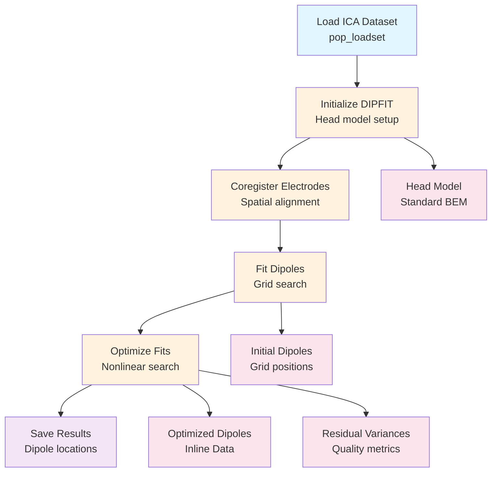

# Example: Source Localization (EEGLAB)

This page explains the [`source_localization_pipeline_eeglab.signalJourney.json`](https://github.com/neuromechanist/signalJourney/blob/main/schema/examples/source_localization_pipeline_eeglab.signalJourney.json) example file, which documents equivalent dipole modeling using EEGLAB's DIPFIT plugin.

## Pipeline Overview

This EEGLAB pipeline demonstrates source localization using equivalent dipole modeling on ICA components:
- **Load ICA dataset** with decomposed components
- **Initialize DIPFIT settings** with head model and electrode locations
- **Coregister electrodes** to the head model coordinate system
- **Fit dipoles** to ICA components using grid search
- **Optimize dipole locations** with nonlinear search algorithms
- **Save results** with dipole locations and quality metrics

## Pipeline Flowchart



## Key EEGLAB DIPFIT Features

### DIPFIT Functions
- **`pop_dipfit_settings`**: Initialize head model and coordinate system
- **`pop_dipfit_gridsearch`**: Grid search for initial dipole locations
- **`pop_dipfit_nonlinear`**: Nonlinear optimization of dipole parameters
- **Standard templates**: Built-in BEM head models and electrode locations

### Source Localization Approach
- **Equivalent dipole modeling**: Single dipole per ICA component
- **MNI coordinate system**: Standardized brain coordinate space
- **Residual variance**: Goodness-of-fit metric for dipole solutions
- **Component-based analysis**: Source localization of independent components

## Example JSON Structure

```json
{
  "stepId": "5",
  "name": "Optimize Dipole Fits",
  "software": {
    "name": "EEGLAB DIPFIT",
    "version": "4.3",
    "functionCall": "pop_dipfit_nonlinear(EEG, 'component', find([EEG.dipfit.model.rv] < 0.15))"
  },
  "parameters": {
    "component_selection": "rv < 0.15",
    "threshold": 0.15,
    "optimization_method": "nonlinear"
  },
  "qualityMetrics": {
    "dipoles_optimized": "{{num_optimized_dipoles}}",
    "mean_residual_variance": "{{mean_rv_after_optimization}}",
    "max_residual_variance": "{{max_rv_after_optimization}}"
  }
}
```

### Inline Data Documentation
The pipeline preserves critical dipole information using inline data:

```json
{
  "targetType": "inlineData",
  "name": "dipole_locations",
  "data": "{{dipole_coordinates_mni}}",
  "formatDescription": "Array of dipole coordinates in MNI space [n_components x 3]",
  "description": "Fitted dipole locations for all components"
}
```

## EEGLAB vs MNE-Python Comparison

| Aspect | EEGLAB Version | MNE-Python Version |
|--------|----------------|-------------------|
| **Method** | Equivalent dipole modeling | Distributed source modeling |
| **Approach** | Component-based (ICA) | Sensor-based (evoked data) |
| **Head Model** | Standard BEM templates | Custom BEM/sphere models |
| **Coordinates** | MNI space | Individual/fsaverage space |
| **Software** | DIPFIT plugin | MNE forward/inverse functions |
| **Complexity** | Single dipole per component | Thousands of dipole sources |

## Advanced Features

### Quality Control Integration
- **Residual variance thresholds**: Automated dipole acceptance criteria
- **Component classification**: Integration with ICLabel for source validation
- **Spatial constraints**: Dipole locations constrained to brain regions

### Coordinate System Management
- **MNI standardization**: Dipole locations in standard brain space
- **Electrode coregistration**: Proper alignment between data and head model
- **Template integration**: Use of standard head models for group analysis

## Usage Notes

This example demonstrates:
- **Component-based source localization** using equivalent dipole modeling
- **DIPFIT workflow documentation** with complete parameter preservation
- **Quality control integration** for dipole fitting validation
- **Coordinate system management** for standardized source locations

The DIPFIT approach is particularly well-suited for ICA component localization, providing interpretable source locations for independent components identified in the data. This contrasts with the distributed source modeling approach typically used with MNE-Python, offering complementary perspectives on EEG source analysis. 