# Example: Source Localization (EEGLAB)

This page explains the [`source_localization_pipeline_eeglab.signalJourney.json`](https://github.com/signalJourney/signalJourney/blob/main/schema/examples/source_localization_pipeline_eeglab.signalJourney.json) example file, which documents equivalent dipole modeling using EEGLAB's DIPFIT plugin.

## Pipeline Overview

This EEGLAB pipeline demonstrates source localization using equivalent dipole modeling on ICA components:
- **Load ICA dataset** with decomposed components from artifact removal pipeline
- **Initialize DIPFIT settings** with head model and electrode locations
- **Coregister electrodes** to the head model coordinate system
- **Perform grid search** for initial dipole locations across components
- **Optimize dipole locations** with nonlinear search algorithms
- **Save dipole results** with locations and quality metrics

## Pipeline Flowchart

```mermaid
flowchart TD
    A[Load ICA Dataset<br/>pop_loadset] --> B[Initialize DIPFIT<br/>pop_dipfit_settings]
    B --> C[Coregister Electrodes<br/>pop_dipfit_batch]
    C --> D[Grid Search Dipoles<br/>pop_dipfit_gridsearch]
    D --> E[Optimize Dipole Fits<br/>pop_dipfit_nonlinear]
    E --> F[Save Results<br/>pop_saveset]
    
    %% Input files
    G["📁 sub-01_task-rest_desc-ica_eeg.set<br/>From: ICA decomposition"] --> A
    H["📁 Standard BEM<br/>DIPFIT head model"] --> B
    I["📁 Electrode Template<br/>Standard locations"] --> B
    
    %% Inline data
    B --> V1["📊 Coordinate System<br/>MNI space"]
    D --> V2["📊 Grid Resolution<br/>20mm spacing"]
    E --> V3["📊 RV Threshold<br/>< 15% residual"]
    
    %% Final outputs
    F --> J["💾 sub-01_task-rest_desc-dipoles_eeg.set<br/>Dataset with dipoles"]
    E --> K["💾 sub-01_task-rest_desc-dipole_plot.png<br/>Brain visualization"]
    
    %% Quality metrics
    D --> Q1["📈 Components fitted: 25/32<br/>Initial RV: 12.3%"]
    E --> Q2["📈 Optimized dipoles: 18<br/>Final RV: 8.7%"]

    %% Styling
    classDef processStep fill:#e1f5fe,stroke:#01579b,stroke-width:2px
    classDef inputFile fill:#fff3e0,stroke:#e65100,stroke-width:2px
    classDef outputFile fill:#e8f5e8,stroke:#1b5e20,stroke-width:2px
    classDef inlineData fill:#f3e5f5,stroke:#4a148c,stroke-width:1px
    classDef qualityMetric fill:#f9f9f9,stroke:#666,stroke-width:1px

    class A,B,C,D,E,F processStep
    class G,H,I inputFile
    class J,K outputFile
    class V1,V2,V3 inlineData
    class Q1,Q2 qualityMetric
```



## Key EEGLAB DIPFIT Features Demonstrated

### DIPFIT Core Functions
- **`pop_dipfit_settings`**: Initialize head model and coordinate system setup
- **`pop_dipfit_batch`**: Electrode coregistration to head model
- **`pop_dipfit_gridsearch`**: Grid search for initial dipole locations
- **`pop_dipfit_nonlinear`**: Nonlinear optimization of dipole parameters
- **Template integration**: Standard BEM head models and electrode templates

### Equivalent Dipole Modeling
- **Component-based analysis**: Single dipole per ICA component
- **MNI coordinate system**: Standardized brain space for group analysis
- **Residual variance**: Goodness-of-fit metric for dipole quality
- **Spatial constraints**: Dipoles constrained to physiologically plausible locations

## Example JSON Structure

The dipole optimization demonstrates EEGLAB's component-based approach:

```json
{
  "stepId": "5",
  "name": "Optimize Dipole Fits",
  "description": "Nonlinear optimization of dipole locations for components with low residual variance.",
  "software": {
    "name": "EEGLAB DIPFIT",
    "version": "4.3",
    "functionCall": "pop_dipfit_nonlinear(EEG, 'component', find([EEG.dipfit.model.rv] < 0.15))"
  },
  "parameters": {
    "component_selection": "rv < 0.15",
    "threshold": 0.15,
    "optimization_method": "nonlinear",
    "mni_coord": true
  },
  "qualityMetrics": {
    "dipoles_optimized": 18,
    "mean_residual_variance": 0.087,
    "components_localized": "72% (18/25)"
  }
}
```

### DIPFIT Settings Configuration
The head model initialization shows EEGLAB's template system:

```json
{
  "stepId": "2", 
  "name": "Initialize DIPFIT",
  "description": "Setup DIPFIT with standard BEM head model and coordinate system.",
  "software": {
    "name": "EEGLAB DIPFIT",
    "version": "4.3",
    "functionCall": "pop_dipfit_settings(EEG, 'hdmfile', 'standard_BEM.mat', 'coordformat', 'MNI')"
  },
  "parameters": {
    "hdmfile": "standard_BEM.mat",
    "coordformat": "MNI",
    "mrifile": "avg152t1.mat",
    "chanfile": "standard_1005.elc"
  }
}
```

## DIPFIT Source Localization Features

### Equivalent Dipole Analysis
- **Single dipole assumption**: One dipole per independent component
- **Grid search initialization**: Systematic search across brain volume
- **Nonlinear optimization**: Refinement of dipole position and orientation
- **Quality assessment**: Residual variance and explained variance metrics

### Coordinate System Integration
- **MNI standardization**: Results in standard brain coordinate space
- **Template head models**: Standard BEM for group-level analysis
- **Electrode coregistration**: Proper spatial alignment procedures
- **Brain visualization**: Integration with EEGLAB plotting functions

### Quality Control Features
- **Residual variance thresholds**: Automated dipole acceptance criteria
- **Component selection**: Based on ICA decomposition quality
- **Spatial validation**: Dipoles constrained to gray matter regions
- **Outlier detection**: Identification of poorly fitted dipoles

## EEGLAB vs MNE-Python Comparison

| Aspect | EEGLAB Version | MNE-Python Version |
|--------|----------------|-------------------|
| **Modeling Approach** | Equivalent dipole (single) | Distributed sources (thousands) |
| **Analysis Target** | ICA components | Sensor-level data |
| **Head Model** | Standard BEM templates | Custom BEM/FreeSurfer |
| **Coordinate System** | MNI space | Individual/fsaverage |
| **Software Plugin** | DIPFIT plugin | Core MNE functions |
| **Computational Cost** | Low (few dipoles) | High (dense source space) |

## DIPFIT-Specific Workflow

### ICA Component Integration
DIPFIT analysis leverages ICA decomposition results:
1. **Component selection**: Based on ICLabel classification and quality
2. **Spatial patterns**: Component topographies used for source fitting
3. **Time courses**: Independent component activations preserved
4. **Quality metrics**: Component-specific residual variance

### Template-Based Analysis
- **Standard head models**: Facilitates group-level comparisons
- **Electrode templates**: Standard 10-20 and high-density layouts
- **MNI brain space**: Enables meta-analysis and literature comparison
- **Automated workflows**: Batch processing for multiple datasets

### Interactive Analysis Features
- **GUI integration**: Pop-up functions for parameter adjustment
- **Visual feedback**: Real-time dipole visualization during fitting
- **Manual refinement**: Interactive dipole position adjustment
- **Quality inspection**: Visual assessment of dipole fits

## Usage Notes

This example demonstrates:
- **Component-based source localization** using equivalent dipole modeling
- **DIPFIT workflow documentation** with complete parameter preservation  
- **Quality control integration** for automated dipole validation
- **Template-based analysis** for standardized group studies
- **ICA integration** leveraging independent component analysis

The DIPFIT approach provides an interpretable source localization method particularly well-suited for ICA components, offering complementary insights to distributed source modeling approaches. The equivalent dipole assumption enables straightforward interpretation while maintaining computational efficiency for routine analysis workflows. 