# Example: Source Localization (MNE-Python)

This page explains the [`source_localization_pipeline_mne.signalJourney.json`](https://github.com/neuromechanist/signalJourney/blob/main/schema/examples/source_localization_pipeline_mne.signalJourney.json) example file, documenting a source localization workflow using distributed source modeling with MNE-Python.

## Pipeline Overview

This MNE-Python pipeline demonstrates brain source localization using forward/inverse modeling:
- **Load preprocessed evoked data** from averaged epochs
- **Setup source space** using FreeSurfer fsaverage template
- **Compute BEM solution** for head modeling
- **Create forward solution** (leadfield matrix)
- **Compute noise covariance** from baseline periods
- **Create inverse operator** for source estimation
- **Apply dSPM inverse solution** to estimate source time courses

## Pipeline Flowchart

```mermaid
flowchart TD
    A[Load Evoked Data<br/>mne.read_evokeds] --> B[Setup Source Space<br/>mne.setup_source_space]
    B --> C[Compute BEM Solution<br/>mne.make_bem_solution]
    C --> D[Create Forward Solution<br/>mne.make_forward_solution]
    D --> E[Compute Covariance<br/>mne.compute_covariance]
    E --> F[Create Inverse Operator<br/>mne.minimum_norm.make_inverse_operator]
    F --> G[Apply dSPM Solution<br/>mne.minimum_norm.apply_inverse]
    
    %% Input data and resources
    H["📁 sub-01_task-rest_ave.fif<br/>Averaged evoked data"] --> A
    I["📁 sub-01_task-rest_epo.fif<br/>Epochs for covariance"] --> E
    J["📁 fsaverage<br/>Template brain anatomy"] --> B
    K["📁 BEM surfaces<br/>Head model"] --> C
    
    %% Intermediate outputs
    A --> A1["📊 Evoked Object<br/>Averaged responses"]
    B --> B1["📊 Source Space<br/>Cortical vertices (oct6)"]
    C --> C1["📊 BEM Solution<br/>Head conductivity model"]
    D --> D1["📊 Forward Solution<br/>Leadfield matrix"]
    E --> E1["📊 Covariance Matrix<br/>Noise covariance"]
    F --> F1["📊 Inverse Operator<br/>dSPM operator"]
    
    %% Analysis parameters
    B --> V1["📈 Source Spacing<br/>oct6 (4098 vertices)"]
    C --> V2["📈 Conductivity<br/>[0.3, 0.006, 0.3] S/m"]
    F --> V3["📈 SNR Parameters<br/>λ² = 1/SNR²"]
    
    %% Final outputs
    G --> L["💾 sub-01_task-rest_desc-dSPM_stc.h5<br/>Source time courses"]
    G --> M["💾 sub-01_task-rest_desc-sources_plot.png<br/>Brain activation plot"]
    
    %% Quality metrics
    D --> Q1["📈 Forward channels: 64<br/>Source points: 4098"]
    G --> Q2["📈 Peak activation: 15.2 dSPM<br/>Location: Left STG"]

    %% Styling
    classDef processStep fill:#e1f5fe,stroke:#01579b,stroke-width:2px
    classDef inputFile fill:#fff3e0,stroke:#e65100,stroke-width:2px
    classDef outputFile fill:#e8f5e8,stroke:#1b5e20,stroke-width:2px
    classDef inMemoryData fill:#e3f2fd,stroke:#1565c0,stroke-width:1px
    classDef inlineData fill:#f3e5f5,stroke:#4a148c,stroke-width:1px
    classDef qualityMetric fill:#f9f9f9,stroke:#666,stroke-width:1px

    class A,B,C,D,E,F,G processStep
    class H,I,J,K inputFile
    class L,M outputFile
    class A1,B1,C1,D1,E1,F1 inMemoryData
    class V1,V2,V3 inlineData
    class Q1,Q2 qualityMetric
```



## Key MNE-Python Features Demonstrated

### Source Localization Functions
- **`mne.read_evokeds`**: Load averaged evoked responses from FIF files
- **`mne.setup_source_space`**: Create source space from FreeSurfer anatomy
- **`mne.make_bem_solution`**: Compute boundary element model head solution
- **`mne.make_forward_solution`**: Calculate leadfield matrix
- **`mne.minimum_norm.make_inverse_operator`**: Create inverse solution operator
- **`mne.minimum_norm.apply_inverse`**: Apply dSPM source estimation

### Advanced Source Modeling
- **Source space**: Cortical surface-based source model with configurable resolution
- **Forward modeling**: Realistic head geometry using boundary element method
- **Inverse methods**: dSPM, sLORETA, eLORETA distributed source solutions
- **Regularization**: SNR-based regularization parameter selection

## Example JSON Structure

The forward solution computation demonstrates complex dependency management:

```json
{
  "stepId": "4",
  "name": "Create Forward Solution",
  "description": "Compute leadfield matrix relating sources to sensors.",
  "software": {
    "name": "MNE-Python",
    "version": "1.6.1",
    "functionCall": "mne.make_forward_solution(evoked.info, trans, src, bem_sol, eeg=True, mindist=5.0)"
  },
  "parameters": {
    "trans": "fsaverage",
    "eeg": true,
    "meg": false,
    "mindist": 5.0,
    "n_jobs": 1,
    "verbose": false
  },
  "dependsOn": ["1", "2", "3"]
}
```

### Inverse Solution Application
The dSPM application step shows advanced parameter control:

```json
{
  "stepId": "7",
  "name": "Apply dSPM Solution",
  "description": "Estimate source time courses using dynamic Statistical Parametric Mapping.",
  "software": {
    "name": "MNE-Python", 
    "version": "1.6.1",
    "functionCall": "mne.minimum_norm.apply_inverse(evoked, inverse_operator, lambda2, method='dSPM')"
  },
  "parameters": {
    "method": "dSPM",
    "lambda2": 0.111111,
    "pick_ori": "normal",
    "verbose": false
  },
  "qualityMetrics": {
    "peakActivation": 15.2,
    "peakLocation": "Left STG",
    "snrEstimate": 3.0
  }
}
```

## Source Localization Features

### Anatomical Integration
- **FreeSurfer compatibility**: Seamless integration with FreeSurfer anatomy
- **Template brains**: Support for fsaverage and individual anatomies
- **Source space options**: Surface-based, volumetric, or mixed source models
- **Coordinate systems**: MNI, Talairach, and individual head coordinates

### Forward Modeling Accuracy
- **BEM head model**: Multi-layer realistic head geometry
- **Conductor specification**: Brain, skull, and scalp conductivity values
- **Sensor modeling**: Accurate EEG and MEG sensor positions
- **Quality assessment**: Forward solution validation metrics

### Inverse Solution Methods
- **Minimum norm estimation**: L2-regularized linear inverse solutions
- **dSPM normalization**: Dynamic statistical parametric mapping
- **sLORETA**: Standardized low resolution electromagnetic tomography
- **eLORETA**: Exact low resolution electromagnetic tomography

## MNE-Python vs EEGLAB Comparison

| Aspect | MNE-Python Version | EEGLAB Version |
|--------|-------------------|----------------|
| **Anatomy** | FreeSurfer integration | DIPFIT equivalent dipoles |
| **Forward Model** | BEM head model | 3-sphere or BEM |
| **Inverse Method** | dSPM, sLORETA, eLORETA | LORETA, sLORETA |
| **Source Space** | Cortical surface-based | Volumetric grid |
| **Visualization** | 3D brain rendering | 2D slice display |
| **File Format** | HDF5, STC files | .mat files |

## Usage Notes

This example demonstrates:
- **Comprehensive source localization** with realistic head modeling
- **Multi-step dependency management** for complex workflows
- **External resource integration** (FreeSurfer, BEM surfaces)
- **Quality metrics** for source localization validation
- **Advanced parameter documentation** for reproducible inverse solutions

The pipeline showcases MNE-Python's sophisticated source localization capabilities while maintaining complete parameter transparency for reproducible brain source estimation. The integration of anatomical templates and realistic head modeling provides state-of-the-art source localization accuracy. 