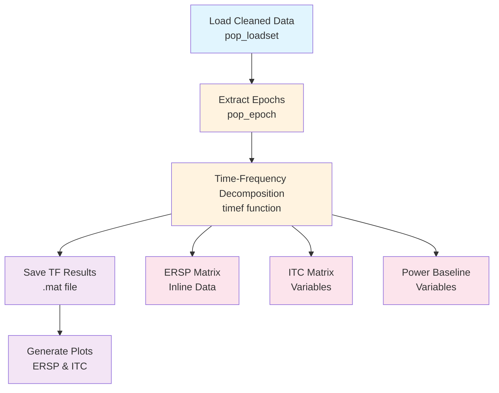

# Example: Time-Frequency Analysis (EEGLAB)

This page explains the [`time_frequency_analysis_pipeline_eeglab.signalJourney.json`](https://github.com/neuromechanist/signalJourney/blob/main/schema/examples/time_frequency_analysis_pipeline_eeglab.signalJourney.json) example file, which documents time-frequency decomposition using EEGLAB's `timef` function.

## Pipeline Overview

This EEGLAB pipeline demonstrates time-frequency analysis using EEGLAB's wavelet decomposition capabilities:
- **Load cleaned data** from ICA decomposition pipeline
- **Extract event-related epochs** for time-frequency analysis
- **Compute time-frequency decomposition** using `timef` function
- **Apply baseline correction** and save results
- **Generate visualization plots** for ERSP and ITC

## Pipeline Flowchart



## Key EEGLAB Features

### Time-Frequency Functions
- **`timef`**: EEGLAB's comprehensive time-frequency analysis function
- **Wavelet parameters**: Cycle specification for frequency-dependent resolution
- **Baseline correction**: Built-in baseline normalization options
- **Output flexibility**: ERSP, ITC, and power baseline matrices

### signalJourney Documentation
- **Parameter preservation**: Complete `timef` parameter documentation
- **Multiple outputs**: ERSP, ITC, and baseline data saved separately
- **Visualization integration**: Plot generation as documented processing step

## Example JSON Structure

```json
{
  "stepId": "3",
  "name": "Compute Time-Frequency Decomposition",
  "software": {
    "name": "EEGLAB",
    "version": "2023.1",
    "functionCall": "[ersp, itc, powbase, times, freqs] = timef(EEG.data, EEG.pnts, [EEG.xmin EEG.xmax]*1000, EEG.srate, [3 0.5], 'baseline', [-500 0], 'freqs', [2 40])"
  },
  "parameters": {
    "cycles": [3, 0.5],
    "baseline": [-500, 0],
    "freqs": [2, 40],
    "plotitc": "off",
    "plotersp": "off"
  }
}
```

## EEGLAB vs MNE-Python Comparison

| Aspect | EEGLAB Version | MNE-Python Version |
|--------|----------------|-------------------|
| **Function** | `timef` (all-in-one) | `tfr_morlet`, `tfr_multitaper` |
| **Baseline** | Built-in correction | Separate `apply_baseline` |
| **Outputs** | ERSP, ITC, power baseline | Power, ITC (separate functions) |
| **Plotting** | Integrated visualization | External plotting functions |
| **Flexibility** | Single comprehensive function | Modular approach |

## Usage Notes

This example demonstrates:
- **EEGLAB time-frequency workflows** using the `timef` function
- **Complete parameter documentation** for wavelet analysis
- **Multiple output documentation** (ERSP, ITC, baseline)
- **Integrated visualization** as part of the processing pipeline

The pipeline showcases how signalJourney can document EEGLAB's integrated approach to time-frequency analysis while preserving all parameters for reproducibility. 