# Example: Time-Frequency Analysis (EEGLAB)

This page explains the [`time_frequency_analysis_pipeline_eeglab.signalJourney.json`](https://github.com/neuromechanist/signalJourney/blob/main/schema/examples/time_frequency_analysis_pipeline_eeglab.signalJourney.json) example file, which documents time-frequency decomposition using EEGLAB's `timef` function.

## Pipeline Overview

This EEGLAB pipeline demonstrates time-frequency analysis using EEGLAB's wavelet decomposition capabilities:
- **Load cleaned data** from ICA decomposition pipeline
- **Extract event-related epochs** for time-frequency analysis
- **Compute time-frequency decomposition** using `timef` function
- **Apply baseline correction** and save results
- **Generate visualization plots** for ERSP and ITC

## Pipeline Flowchart

```mermaid
flowchart TD
    A[Load Cleaned Data<br/>pop_loadset] --> B[Extract Epochs<br/>pop_epoch]
    B --> C[Compute ERSP<br/>timef]
    C --> D[Compute ITC<br/>newtimef]
    D --> E[Save Results<br/>pop_saveset]
    
    %% Input file
    F["📁 sub-01_task-rest_desc-cleaned_eeg.set<br/>From: ICA Decomposition Pipeline"] --> A
    
    %% Inline data
    C --> V1["📊 Frequencies<br/>[3:0.5:30] Hz"]
    C --> V2["📊 Cycles<br/>[3 0.5] wavelet"]
    C --> V3["📊 Baseline<br/>[-200 0] ms"]
    
    %% Final outputs
    E --> G["💾 sub-01_task-rest_desc-ersp_eeg.set<br/>ERSP results"]
    E --> H["💾 sub-01_task-rest_desc-itc_eeg.set<br/>ITC results"]
    D --> I["💾 sub-01_task-rest_desc-tfr_plot.fig<br/>EEGLAB figure"]
    
    %% Quality metrics
    C --> Q1["📈 Frequency bins: 55<br/>Time points: 200"]
    D --> Q2["📈 Baseline mode: Relative<br/>Significance: p<0.01"]

    %% Styling
    classDef processStep fill:#e1f5fe,stroke:#01579b,stroke-width:2px
    classDef inputFile fill:#fff3e0,stroke:#e65100,stroke-width:2px
    classDef outputFile fill:#e8f5e8,stroke:#1b5e20,stroke-width:2px
    classDef inlineData fill:#f3e5f5,stroke:#4a148c,stroke-width:1px
    classDef qualityMetric fill:#f9f9f9,stroke:#666,stroke-width:1px

    class A,B,C,D,E processStep
    class F inputFile
    class G,H,I outputFile
    class V1,V2,V3 inlineData
    class Q1,Q2 qualityMetric
```



## Key EEGLAB Features Demonstrated

### EEGLAB Time-Frequency Functions
- **`pop_epoch`**: Extract event-related epochs from continuous data
- **`timef`**: Time-frequency decomposition with Morlet wavelets
- **`newtimef`**: Enhanced time-frequency analysis with bootstrap statistics
- **`pop_saveset`**: Save results in EEGLAB dataset format

### EEGLAB-Specific Parameters
- **Wavelet specification**: EEGLAB's [cycles freqs] format
- **Baseline correction**: Built into `timef` function
- **Statistical testing**: Bootstrap significance testing
- **Visualization**: Automatic ERSP and ITC plotting

## Example JSON Structure

The EEGLAB time-frequency computation demonstrates integrated analysis:

```json
{
  "stepId": "3",
  "name": "Compute ERSP",
  "description": "Calculate event-related spectral perturbation using EEGLAB timef.",
  "software": {
    "name": "EEGLAB", 
    "version": "2023.1",
    "functionCall": "timef(EEG.data, frames, tlimits, srate, cycles, 'baseline', [-200 0], 'plotitc', 'off')"
  },
  "parameters": {
    "frames": 1000,
    "tlimits": [-500, 1000],
    "srate": 500,
    "cycles": [3, 0.5],
    "freqs": [3, 30],
    "nfreqs": 55,
    "baseline": [-200, 0],
    "baselinetype": "relative",
    "plotitc": "off",
    "plotersp": "on"
  }
}
```

### Integrated Output Documentation
EEGLAB's `timef` produces multiple outputs simultaneously:

```json
"outputTargets": [
  {
    "targetType": "in-memory",
    "format": "double",
    "description": "ERSP matrix (freqs x times x trials).",
    "variableName": "ersp"
  },
  {
    "targetType": "in-memory", 
    "format": "double",
    "description": "ITC matrix (freqs x times).",
    "variableName": "itc"
  },
  {
    "targetType": "in-memory",
    "format": "double",
    "description": "Power base matrix for baseline correction.",
    "variableName": "powbase"
  }
]
```

## EEGLAB Time-Frequency Features

### Wavelet Parameter System
- **Cycles specification**: `[min_cycles max_cycles]` format
- **Automatic scaling**: Cycles increase linearly with frequency
- **Frequency resolution**: Number of frequency bins automatically calculated
- **Time resolution**: Determined by cycle parameters and sampling rate

### Baseline Correction Options
- **Relative**: `(power - baseline) / baseline`
- **Absolute**: `power - baseline`
- **Relchange**: `(power - baseline) / baseline * 100`
- **Log**: `10 * log10(power / baseline)`

### Bootstrap Statistics
- **Significance testing**: Built-in permutation testing
- **Multiple comparison correction**: False discovery rate (FDR)
- **Confidence intervals**: Bootstrap confidence bounds
- **Alpha level**: Customizable significance threshold

## EEGLAB vs MNE-Python Comparison

| Aspect | EEGLAB Version | MNE-Python Version |
|--------|----------------|-------------------|
| **Function** | `timef`, `newtimef` | `tfr_morlet` |
| **Output** | ERSP + ITC combined | Power only (separate ITC) |
| **Baseline** | Built into function | Separate `apply_baseline()` |
| **Statistics** | Bootstrap testing | External stats required |
| **Visualization** | Automatic EEGLAB plots | matplotlib customization |
| **File Format** | .set/.mat files | HDF5/NPZ formats |

## EEGLAB-Specific Workflow

### Integrated Analysis Approach
EEGLAB's `timef` provides:
1. **Combined ERSP/ITC computation** in single function call
2. **Automatic baseline correction** with multiple methods
3. **Built-in statistical testing** via bootstrap procedures
4. **Immediate visualization** with publication-ready plots

### EEG Dataset Integration
- **Event information** automatically extracted from EEG.event
- **Channel locations** used for topographic plotting
- **Dataset history** updated with analysis parameters
- **STUDY compatibility** for group-level analysis

## Usage Notes

This example demonstrates:
- **EEGLAB's integrated approach** to time-frequency analysis
- **Automatic parameter optimization** for wavelet decomposition
- **Built-in statistical testing** for significance assessment
- **Multi-output handling** with ERSP, ITC, and baseline data
- **EEGLAB visualization** with publication-ready plots

The pipeline showcases EEGLAB's comprehensive time-frequency analysis capabilities with emphasis on ease-of-use and integrated statistical testing while maintaining full parameter documentation for reproducibility. 