# Example: Time-Frequency Analysis (MNE-Python)

This page explains the [`time_frequency_analysis_pipeline_mne.signalJourney.json`](https://github.com/signalJourney/signalJourney/blob/main/schema/examples/time_frequency_analysis_pipeline_mne.signalJourney.json) example file, which documents a typical time-frequency analysis using MNE-Python.

## Pipeline Overview

This MNE-Python pipeline demonstrates time-frequency analysis using Morlet wavelets:
- **Load cleaned data** from ICA decomposition pipeline
- **Extract event-related epochs**
- **Compute time-frequency decomposition** using `mne.time_frequency.tfr_morlet`
- **Apply baseline correction** and save results
- **Generate visualization plots**

## Pipeline Flowchart

```mermaid
flowchart TD
    A[Load Cleaned Data<br/>mne.io.read_raw_fif] --> B[Extract Epochs<br/>mne.Epochs]
    B --> C[Compute TFR<br/>mne.time_frequency.tfr_morlet]
    C --> D[Apply Baseline Correction<br/>tfr.apply_baseline]
    D --> E[Save TFR Results<br/>tfr.save]
    
    %% Input file
    F["📁 sub-01_task-rest_desc-cleaned_eeg.fif<br/>From: ICA Decomposition Pipeline"] --> A
    
    %% Inline data
    C --> V2["📊 Frequencies<br/>[4, 8, 13, 30] Hz"]
    
    %% Final outputs
    E --> G["💾 sub-01_task-rest_desc-tfr_eeg.h5<br/>Time-frequency results"]
    D --> H["💾 sub-01_task-rest_desc-tfr_plot.png<br/>Visualization"]
    
    %% Quality metrics
    C --> Q1["📈 Frequency range: 4-30 Hz<br/>Cycles: 2-15"]
    D --> Q2["📈 Baseline: [-0.2, 0] s<br/>Mode: percent"]

    %% Styling
    classDef processStep fill:#e1f5fe,stroke:#01579b,stroke-width:2px
    classDef inputFile fill:#fff3e0,stroke:#e65100,stroke-width:2px
    classDef outputFile fill:#e8f5e8,stroke:#1b5e20,stroke-width:2px
    classDef inlineData fill:#f3e5f5,stroke:#4a148c,stroke-width:1px
    classDef qualityMetric fill:#f9f9f9,stroke:#666,stroke-width:1px

    class A,B,C,D,E processStep
    class F inputFile
    class G,H outputFile
    class V2 inlineData
    class Q1,Q2 qualityMetric
```



## Key MNE-Python Features Demonstrated

### Time-Frequency Functions
- **`mne.Epochs`**: Event-related epoch extraction
- **`mne.time_frequency.tfr_morlet`**: Morlet wavelet decomposition
- **`tfr.apply_baseline`**: Baseline correction for power changes
- **`tfr.save`**: Save time-frequency results in HDF5 format

### Advanced Parameters
- **Wavelet parameters**: Adaptive cycles for different frequencies
- **Baseline correction**: Percent change from pre-stimulus period
- **Frequency selection**: Logarithmically spaced frequencies
- **Output formats**: Both HDF5 data and PNG visualization

## Example JSON Structure

The time-frequency computation step demonstrates complex parameter documentation:

```json
{
  "stepId": "3",
  "name": "Compute Time-Frequency Decomposition",
  "description": "Calculate time-frequency representation using Morlet wavelets.",
  "software": {
    "name": "MNE-Python",
    "version": "1.6.1",
    "functionCall": "mne.time_frequency.tfr_morlet(epochs, freqs=freqs, n_cycles=n_cycles, return_itc=False)"
  },
  "parameters": {
    "freqs": [4, 6, 8, 10, 13, 17, 22, 30],
    "n_cycles": [2, 3, 4, 5, 6.5, 8.5, 11, 15],
    "use_fft": true,
    "return_itc": false,
    "decim": 1,
    "n_jobs": 1
  }
}
```

### Multi-Output Documentation
Steps can produce multiple related outputs:

```json
"outputTargets": [
  {
    "targetType": "file",
    "location": "./derivatives/signaljourney/sub-01/eeg/sub-01_task-rest_desc-tfr_eeg.h5",
    "format": "HDF5",
    "description": "Time-frequency power data."
  },
  {
    "targetType": "file", 
    "location": "./derivatives/signaljourney/sub-01/eeg/sub-01_task-rest_desc-tfr_plot.png",
    "format": "PNG",
    "description": "Time-frequency plot visualization."
  }
]
```

## Time-Frequency Analysis Features

### Wavelet Parameter Selection
- **Frequency-dependent cycles**: Lower frequencies use fewer cycles for better temporal resolution
- **Higher frequencies**: More cycles for better frequency resolution
- **Adaptive approach**: Balances time-frequency trade-off across spectrum

### Baseline Correction Methods
- **Percent change**: `(power - baseline) / baseline * 100`
- **Ratio**: `power / baseline`
- **Decibel**: `10 * log10(power / baseline)`
- **Z-score**: `(power - baseline_mean) / baseline_std`

## MNE-Python vs EEGLAB Comparison

| Aspect | MNE-Python Version | EEGLAB Version |
|--------|-------------------|----------------|
| **Method** | Morlet wavelets | Morlet wavelets (timef) |
| **Baseline** | `apply_baseline()` | Built into `timef` |
| **Output** | HDF5, NPZ formats | MATLAB .mat files |
| **Visualization** | matplotlib plots | EEGLAB plots |
| **Cycles** | Manual specification | Automatic or manual |

## Usage Notes

This example demonstrates:
- **Time-frequency decomposition** with optimal parameters
- **Baseline correction** for interpretable results
- **Multi-format outputs** for analysis and visualization
- **Pipeline integration** building on previous processing steps
- **Quality documentation** for reproducible analysis

The pipeline showcases MNE-Python's comprehensive time-frequency analysis capabilities while maintaining full parameter transparency for reproducibility. 